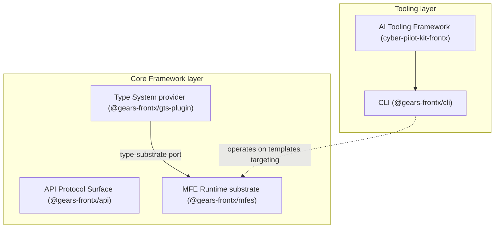
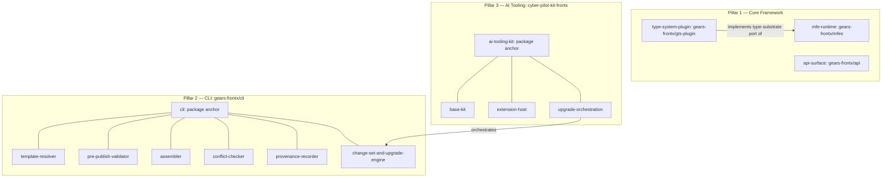

# Technical Design — FrontX Ecosystem


<!-- toc -->

- [1. Architecture Overview](#1-architecture-overview)
  - [1.1 Architectural Vision](#11-architectural-vision)
  - [1.2 Architecture Drivers](#12-architecture-drivers)
  - [1.3 Architecture Layers](#13-architecture-layers)
- [2. Principles & Constraints](#2-principles--constraints)
  - [2.1 Design Principles](#21-design-principles)
  - [2.2 Constraints](#22-constraints)
- [3. Technical Architecture](#3-technical-architecture)
  - [3.1 Domain Model](#31-domain-model)
  - [3.2 Component Model](#32-component-model)
  - [3.3 API Contracts](#33-api-contracts)
  - [3.4 Internal Dependencies](#34-internal-dependencies)
  - [3.5 External Dependencies](#35-external-dependencies)
  - [3.6 Interactions & Sequences](#36-interactions--sequences)
  - [3.7 Database schemas & tables](#37-database-schemas--tables)
  - [3.8 Deployment Topology](#38-deployment-topology)
- [4. Additional context](#4-additional-context)
  - [Technology stack alignment](#technology-stack-alignment)
  - [Capacity and NFR thresholds](#capacity-and-nfr-thresholds)
  - [Non-applicable checklist categories](#non-applicable-checklist-categories)
- [5. Traceability](#5-traceability)

<!-- /toc -->

- [ ] `p3` - **ID**: `cpt-frontx-design-ecosystem`

## 1. Architecture Overview

### 1.1 Architectural Vision

The FrontX ecosystem is delivered as a set of independently published, independently versioned artifacts, each owning a single concern and integrating with the others only through narrow, explicit contracts. These artifacts are organized into three co-equal pillars: a **Core Framework** of npm packages (the MFE Runtime `@gears-frontx/mfes`, the Type System plugin `@gears-frontx/gts-plugin`, and the API Protocol Surface `@gears-frontx/api`), a **CLI** (`@gears-frontx/cli`) that drives the template and project lifecycle, and an **AI Tooling Framework** (`cyber-pilot-kit-frontx`) that delivers ecosystem fluency to AI agents. Per-concern independent versioning lets each artifact evolve on its own semver line and cadence while consuming applications upgrade on theirs rather than in lockstep; the one compile-time coupling edge (`mfes → gts-plugin`) is bounded by a satisfiable semver range rather than a matched version number (`cpt-frontx-fr-versioned-platform-evolution`, `cpt-frontx-nfr-evolvability`).

The technical approach centers on an agnostic, narrowly contracted substrate. The Core Framework reasons about microfrontends, type identifiers, and extension domains through injected ports and opaque identifiers rather than concrete formats or solution vocabulary, so an application composes against a stable surface regardless of its UI stack, type-definition specification, or layout vocabulary (`cpt-frontx-fr-ui-framework-agnostic`, `cpt-frontx-fr-mfe-runtime-registration`). The runtime admits units only after type validation, places them into governed extension domains under explicit cardinality and admission rules, mediates host-microfrontend communication through a narrow capability bridge, and isolates loaded units - realizing a default-deny security posture (`cpt-frontx-fr-mfe-type-validation`, `cpt-frontx-nfr-security`). The CLI resolves templates by versioned source-spec at runtime and bundles none, keeping the command surface fully decoupled from the content it scaffolds and applying project upgrades as reviewable, non-destructive change sets (`cpt-frontx-fr-cli-template-install`, `cpt-frontx-fr-cli-project-upgrade-changeset`). The AI Tooling Framework ships only base ecosystem capabilities and gains template-specific expertise through bundled extensions discovered and activated automatically (`cpt-frontx-fr-ai-frontx-skills`, `cpt-frontx-fr-ai-extension-discovery-activation`).

The system context is a composed FrontX application running in the browser, whose host loads independently developed microfrontends at runtime. External boundaries are: the consuming application and its microfrontends (which depend on the Core Framework packages and choose their own UI framework), a GitHub-hosted source registry and an npm package registry that distribute templates and packages, the back-end services that microfrontends call through the API Protocol Surface, and the AI Tooling CLI environment that installs and activates the AI Tooling kit. Within these boundaries the architecture satisfies the PRD by allocating each capability to exactly one owning artifact and placing no architectural ceiling on the microfrontends or type definitions an application integrates (`cpt-frontx-fr-no-architectural-ceiling`, `cpt-frontx-nfr-scalability-ceiling`).

### 1.2 Architecture Drivers

Requirements that significantly influence architecture decisions. Each driver below maps a PRD requirement to the design response that addresses it, citing the requirement by ID; requirement text is owned by the PRD and is not restated here. The Architecture Decision Records subsection records the decisions these drivers rest on.

#### Functional Drivers

| Requirement | Design Response |
|-------------|-----------------|
| `cpt-frontx-fr-mfe-runtime-registration` | MFE Runtime registers units through the abstract `MfeRegistry` facade and loads them on demand via the resolved handler, decided in `cpt-frontx-adr-mfe-runtime-public-surface` and `cpt-frontx-adr-mfe-handler-resolution`; manifest-based discovery (`cpt-frontx-adr-mfe-asset-discovery`) and lazy-import ABI separation (`cpt-frontx-adr-lazy-import-resolution`) support on-demand loading. |
| `cpt-frontx-fr-mfe-multi-occupant-domain` | Extension-domain occupancy is governed by mount strategies and cardinality rules (`cpt-frontx-adr-extension-domain-occupancy`) that admit multiple occupants where a domain permits, with admission gated by contract matching (`cpt-frontx-adr-domain-extension-compatibility`). |
| `cpt-frontx-fr-mfe-host-communication` | Host-microfrontend communication is routed through the actions-chains mediator (`cpt-frontx-adr-action-dispatch-and-chaining`) over a narrow parent-child capability bridge (`cpt-frontx-adr-child-mfe-host-access`). |
| `cpt-frontx-fr-mfe-type-validation` | Units and extensions are validated against type definitions at registration through the opaque type-substrate port (`cpt-frontx-adr-runtime-type-system-coupling`), its default provider (`cpt-frontx-adr-default-type-substrate-provider`), and contract matching (`cpt-frontx-adr-domain-extension-compatibility`). |
| `cpt-frontx-fr-application-type-definitions` | Applications register their own and additional runtime type definitions through the type-substrate port the runtime exposes opaquely (`cpt-frontx-adr-runtime-type-system-coupling`). |
| `cpt-frontx-fr-ui-framework-agnostic` | Core-package boundaries keep the runtime free of UI-framework coupling, leaving UI-stack choice to applications and microfrontends (`cpt-frontx-adr-core-package-boundaries`). |
| `cpt-frontx-fr-versioned-platform-evolution` | The per-concern independent artifact-distribution policy isolates breaking changes behind semantic versioning, bounding each breaking change to a single artifact's own major-version line (`cpt-frontx-adr-artifact-versioning-and-distribution`). |
| `cpt-frontx-fr-no-architectural-ceiling` | The same distribution and boundary policy imposes no architectural cap on integrated units, governing growth by performance thresholds rather than structure (`cpt-frontx-adr-artifact-versioning-and-distribution`). |
| `cpt-frontx-fr-cli-template-install` | The CLI resolves and installs templates by versioned source-spec at runtime (`cpt-frontx-adr-template-acquisition-and-location`, `cpt-frontx-adr-source-spec-syntax`), and a reference may address a template occupying a subtree of a repository. |
| `cpt-frontx-fr-cli-template-list` | Template inventory and versions are reported from the externalized, source-spec-resolved template store (`cpt-frontx-adr-template-acquisition-and-location`). |
| `cpt-frontx-fr-cli-template-update-local` | Local template updates operate on the externalized template store without touching any repository (`cpt-frontx-adr-template-acquisition-and-location`). |
| `cpt-frontx-fr-cli-template-validate-prepublish` | Pre-publish structure validation runs against the template manifest publication contract, including that the template's declared ownership boundaries are well-formed (`cpt-frontx-adr-template-manifest-contract`, `cpt-frontx-adr-template-ownership-boundary-declaration`). |
| `cpt-frontx-fr-cli-seed-repository` | An installed template is applied to seed a new repository through one uniform apply-and-assemble path that operates over any template (`cpt-frontx-adr-uniform-template-mechanism`, `cpt-frontx-adr-composed-template-resolution`). |
| `cpt-frontx-fr-cli-add-template-to-repository` | An installed template is added into an existing repository through the same apply path, its declared boundaries checked against the templates already applied before any write (`cpt-frontx-adr-uniform-template-mechanism`, `cpt-frontx-adr-assembly-conflict-prevention`). |
| `cpt-frontx-fr-cli-composed-template-resolution` | A repository is assembled from one or more templates, and a preset's referenced templates are resolved transitively and applied in one operation (`cpt-frontx-adr-composed-template-resolution`). |
| `cpt-frontx-fr-cli-template-boundary-declaration` | A template declares the exclusive subtrees and shared-file regions it owns, carried in its manifest (`cpt-frontx-adr-template-ownership-boundary-declaration`, `cpt-frontx-adr-template-manifest-contract`). |
| `cpt-frontx-fr-cli-assembly-conflict-prevention` | A pre-flight intersection check over the staged assembly refuses conflicting claims before any files are written, never silently merging (`cpt-frontx-adr-assembly-conflict-prevention`). |
| `cpt-frontx-fr-cli-project-upgrade-changeset` | Each applied template upgrades independently as a reviewable, non-destructive change set computed against that template's own provenance record (`cpt-frontx-adr-project-upgrade-mechanism`, `cpt-frontx-adr-project-provenance-record`). |
| `cpt-frontx-fr-cli-upgrade-review-approval` | The change-set engine gates application of changes behind explicit review and approval (`cpt-frontx-adr-project-upgrade-mechanism`). |
| `cpt-frontx-fr-ai-frontx-skills` | Base FrontX skills are delivered by the AI Tooling kit, with base content kept solution-agnostic (`cpt-frontx-adr-solution-ai-content-placement`). |
| `cpt-frontx-fr-ai-template-bundle-extensions` | Templates carry AI bundles conforming to the template AI extension contract (`cpt-frontx-adr-template-ai-extension-contract`). |
| `cpt-frontx-fr-ai-extension-discovery-activation` | Installed-template extensions are discovered and activated without manual wiring (`cpt-frontx-adr-extension-discovery-activation`). |
| `cpt-frontx-fr-ai-upgrade-orchestration` | AI-driven upgrade workflows orchestrate and enrich the CLI change-set engine (`cpt-frontx-adr-ai-driven-upgrade-orchestration`). |
| `cpt-frontx-fr-ai-session-start-knowledge` | Ecosystem-knowledge artifacts are packaged as a Constructor Studio kit available at session start (`cpt-frontx-adr-ai-tooling-framework-packaging`). |
| `cpt-frontx-fr-ai-agent-skill-resources` | Kit packaging declares every public agent entry point in the kit manifest as a `skill` resource (invocable entry points) or a `rule` resource (always-loaded navigation rules), ships supporting knowledge content as declared non-public resources, and carries each capability's applicability metadata in the resource document itself, surfaced to any conforming agent host at install — nothing agent-facing undeclared (`cpt-frontx-constraint-kit-declared-skill-rule-resources`, `cpt-frontx-adr-ai-tooling-framework-packaging`). |
| `cpt-frontx-fr-ai-tooling-template-agnostic` | The framework ships no solution-specific AI content; such content arrives only via template bundles (`cpt-frontx-adr-solution-ai-content-placement`). |

#### NFR Allocation

This table maps non-functional requirements from the PRD to specific design/architecture responses, demonstrating how quality attributes are realized.

| NFR ID | NFR Summary | Allocated To | Design Response | Verification Approach |
|--------|-------------|--------------|-----------------|-----------------------|
| `cpt-frontx-nfr-runtime-performance` | Runtime response-time and throughput targets | MFE Runtime; API Protocol Surface | Lazy-import ABI separation defers template-bound build cost from the runtime ABI (`cpt-frontx-adr-lazy-import-resolution`); the realm-shared, retainer-counted fetch cache and plugin short-circuit reuse in-flight and cached results across independently bundled units (`cpt-frontx-adr-api-transport-bypass-and-fetch-sharing`). | Performance benchmarks asserting the PRD p95 registration, on-demand-load, and registration-throughput thresholds. |
| `cpt-frontx-nfr-evolvability` | Versioned releases without lockstep upgrades | Per-concern independent versioning across all artifacts | Independently published, per-concern versioned artifacts, each on its own semver line and cadence; a breaking change is bounded to that artifact's own major version, and cross-artifact compatibility on the single coupled edge (`mfes → gts-plugin`) is expressed as a satisfiable semver range rather than a matched version number (`cpt-frontx-adr-artifact-versioning-and-distribution`). | Per-artifact semver discipline; a compatibility check asserting the `mfes → gts-plugin` range is satisfiable and not exact-pinned (no duplicate-runtime skew); a registry-side deprecation cycle (published notice + minimum window) before any removal. |
| `cpt-frontx-nfr-scalability-ceiling` | No architectural cap on integrated units | Per-concern independent versioning; runtime boundaries | The distribution and boundary architecture imposes no structural ceiling, so integration scales to the PRD operational floors governed only by performance thresholds (`cpt-frontx-adr-artifact-versioning-and-distribution`). | Load test registering the PRD operational floors of microfrontends and type definitions against one application without architectural failure. |
| `cpt-frontx-nfr-security` | Default-deny posture; validated admission | MFE Runtime isolation, contract matching, type validation | Loaded units are isolated at runtime (`cpt-frontx-adr-mfe-load-isolation`); every unit and extension passes contract matching and type validation before admission (`cpt-frontx-adr-domain-extension-compatibility`, `cpt-frontx-adr-runtime-type-system-coupling`), granting no access beyond a domain's declared grants. | Admission audit asserting 100% of admitted units validated and zero access paths outside an extension domain's declared grants. |
| `cpt-frontx-nfr-evolvability` | Versioned releases without lockstep upgrades | CLI change-set & upgrade engine (`cpt-frontx-component-cli-change-set-engine`) | The single authoritative change-set engine applies a template-version transition as a reviewed, approvable, non-destructive and reversible change set computed against that applied template's own provenance record, so each applied template in a repository adopts a newer version on its own cadence without a forced, destructive rewrite; the reviewed change equals the applied change (`cpt-frontx-adr-project-upgrade-mechanism`, `cpt-frontx-adr-cli-internal-decomposition`). | End-to-end upgrade test asserting the applied file set equals the approved change set, that a declined upgrade writes nothing, and that an applied upgrade is reversible. |
| `cpt-frontx-nfr-evolvability` | Versioned releases without lockstep upgrades | AI Tooling Framework (`cpt-frontx-component-ai-base-kit`, `cpt-frontx-component-ai-extension-host`) | Template-sourced expertise plus automatic discovery-and-activation lets each template's AI capabilities evolve and ship on the template's own line while the base kit stays solution-agnostic, so agent capability tracks installed-template versions rather than a lockstep framework release (`cpt-frontx-adr-solution-ai-content-placement`, `cpt-frontx-adr-extension-discovery-activation`, `cpt-frontx-adr-ai-tooling-internal-decomposition`). | Discovery test asserting a newly installed template version activates its bundled extension without a base-kit release, and that removing the template deactivates only its extension. |

#### Architecture Decision Records

The ecosystem's architecture is shaped by the following decision records, grouped by the pillar each one governs. Each record documents one decision in full; this subsection lists the inventory by ID and one-line intent.

Foundational:

* `cpt-frontx-adr-ecosystem-layer-partition` — Partitions the ecosystem into published libraries, templates, and projects orchestration, determines layer membership by property rather than by an authored list of members, and federates artifact ownership so each member owns the artifacts describing itself.
* `cpt-frontx-adr-artifact-versioning-and-distribution` — Distributes the ecosystem as independently published, per-concern, independently versioned artifacts.
* `cpt-frontx-adr-core-package-boundaries` — Partitions the Core Framework into boundary-governed concerns (runtime, type-system provider, protocol surface).
* `cpt-frontx-adr-contract-schema-ownership` — Ends the circular DESIGN↔ADR schema deferral by assigning each owned contract's role to DESIGN, its decision rationale to the ADR, and its concrete field-level schema to the owning FEATURE.

Pillar 1 — Core Framework:

* `cpt-frontx-adr-mfe-runtime-public-surface` — Exposes microfrontend registration and loading through an abstract registry facade.
* `cpt-frontx-adr-runtime-type-system-coupling` — Keeps the runtime's schema surface opaque, with format-specific shape behind the type-system plugin.
* `cpt-frontx-adr-default-type-substrate-provider` — Supplies the ecosystem's default type system as an injectable provider of the runtime's type-substrate port.
* `cpt-frontx-adr-mfe-handler-resolution` — Abstracts the microfrontend handler and resolves it through the registry.
* `cpt-frontx-adr-action-dispatch-and-chaining` — Routes host–microfrontend communication through an actions-chains mediator.
* `cpt-frontx-adr-child-mfe-host-access` — Defines a narrow parent–child capability bridge between host and microfrontend.
* `cpt-frontx-adr-extension-domain-occupancy` — Governs extension-domain occupancy through mount strategies and cardinality rules.
* `cpt-frontx-adr-domain-extension-compatibility` — Admits extensions into domains by contract matching.
* `cpt-frontx-adr-mfe-load-isolation` — Isolates loaded microfrontends at runtime.
* `cpt-frontx-adr-lazy-import-resolution` — Separates the runtime ABI from the template-bound build through lazy import.
* `cpt-frontx-adr-mfe-asset-discovery` — Discovers microfrontends through their manifest contract.
* `cpt-frontx-adr-api-surface-organization` — Separates request/response and streaming behind a common protocol surface.
* `cpt-frontx-adr-api-transport-bypass-and-fetch-sharing` — Provides a plugin short-circuit and a realm-shared fetch cache.

Pillar 2 — CLI:

* `cpt-frontx-adr-template-acquisition-and-location` — Externalizes templates and resolves them by source-spec at runtime.
* `cpt-frontx-adr-source-spec-syntax` — Defines the versioned source-spec syntax for template acquisition, including the optional subtree segment that lets one repository publish several addressable templates.
* `cpt-frontx-adr-uniform-template-mechanism` — Establishes one uniform mechanism that operates over any template, each template declaring what it produces.
* `cpt-frontx-adr-template-manifest-contract` — Defines the template manifest publication contract declaring identity, version, ownership boundaries, and referenced templates.
* `cpt-frontx-adr-template-ownership-boundary-declaration` — Defines the two-tier ownership-boundary declaration (exclusive subtrees plus shared-file region ownership with a declared merge).
* `cpt-frontx-adr-assembly-conflict-prevention` — Detects and refuses conflicting assembly before any write via a pre-flight intersection check and a post-materialization boundary-honesty guard.
* `cpt-frontx-adr-composed-template-resolution` — Assembles a repository from one or more templates and resolves a preset's referenced templates transitively in one operation.
* `cpt-frontx-adr-project-provenance-record` — Records provenance per applied template, one record per applied template with no single whole-repository origin.
* `cpt-frontx-adr-project-upgrade-mechanism` — Upgrades each applied template independently as a reviewable, non-destructive change set.
* `cpt-frontx-adr-cli-internal-decomposition` — Decomposes the single `@gears-frontx/cli` package into internal template-resolver, pre-publish-validator, assembler, conflict-checker, provenance-recorder, and change-set-&-upgrade-engine components.

Pillar 3 — AI Tooling:

* `cpt-frontx-adr-ai-tooling-framework-packaging` — Packages base AI capabilities as a Constructor Studio kit with prefixed resource identifiers.
* `cpt-frontx-adr-template-ai-extension-contract` — Defines the extension contract a template's AI bundle conforms to.
* `cpt-frontx-adr-extension-discovery-activation` — Discovers and activates installed-template AI extensions without manual wiring.
* `cpt-frontx-adr-solution-ai-content-placement` — Separates base ecosystem AI content from solution-specific content.
* `cpt-frontx-adr-ai-driven-upgrade-orchestration` — Orchestrates AI-driven template upgrades over the CLI change-set engine.
* `cpt-frontx-adr-ai-tooling-internal-decomposition` — Decomposes the single `cyber-pilot-kit-frontx` package into internal base-kit, extension-host, and upgrade-orchestration components.

### 1.3 Architecture Layers

The ecosystem layers run from the agnostic runtime substrate up to the tooling that drives the lifecycle around it. The present instance of the delivered set is four npm packages plus one Constructor Studio kit (non-binding; the durable architecture is the per-concern layering, not this count). Each layer's technology choices align with the §2.2 boundary constraints and the NFRs: the runtime substrate stays UI-framework- and type-format-agnostic (MFES-1..MFES-5) so it supports any UI stack, and the type-system layer is the only Core Framework layer permitted a concrete type-definition specification (GTS-PLUGIN-1, GTS-PLUGIN-2).



- [ ] `p3` - **ID**: `cpt-frontx-tech-ecosystem-stack`

| Layer | Responsibility | Technology |
|-------|---------------|------------|
| Presentation | Application and microfrontend UI; chosen freely per unit, not constrained by the platform | Any UI framework (React, Vue, Svelte, vanilla JavaScript); TypeScript |
| Application (Tooling) | Template and repository lifecycle (install, apply, assemble, upgrade) and AI-agent orchestration over it | Node.js CLI (`@gears-frontx/cli`); Constructor Studio kit (`cyber-pilot-kit-frontx`); GitHub source registry; npm package registry |
| Domain (Type System) | Concrete type-definition provider behind the runtime's opaque type-substrate port; infrastructure schemas and validation | TypeScript type-system plugin (`@gears-frontx/gts-plugin`) over a concrete type-definition specification |
| Infrastructure (Runtime substrate) | Agnostic registration, on-demand loading, extension-domain governance, mediation, isolation, and protocol-separated service access | TypeScript runtime (`@gears-frontx/mfes`) with module-federation runtime and lazy import; API Protocol Surface (`@gears-frontx/api`) with a transport peer dependency |

## 2. Principles & Constraints

### 2.1 Design Principles

#### Agnostic core substrate

- [ ] `p2` - **ID**: `cpt-frontx-principle-agnostic-core`

The Core Framework stays agnostic to UI-framework choice, type-system format, and solution-specific vocabulary. The runtime depends on injected, narrowly contracted ports rather than concrete formats or domain values, so the substrate an application composes against is stable regardless of the UI stack, type-definition specification, or layout vocabulary that application adopts. This agnosticism is what lets independently developed units integrate against a fixed, narrow surface.

**ADRs**: `cpt-frontx-adr-core-package-boundaries`

#### Opaque type substrate

- [ ] `p2` - **ID**: `cpt-frontx-principle-opaque-type-substrate`

The runtime reasons about types solely by identity. It holds a type only as an opaque identifier and delegates every schema operation — shape, validation, and hierarchy resolution — to an injected type-system provider, never reading the concrete schema shape itself. Keeping the substrate opaque confines all format-specific knowledge to a single replaceable provider, so the runtime stays independent of any one type-definition specification and a different provider can be composed in without touching the runtime.

**ADRs**: `cpt-frontx-adr-runtime-type-system-coupling`, `cpt-frontx-adr-default-type-substrate-provider`

#### Template-agnostic tooling

- [x] `p2` - **ID**: `cpt-frontx-principle-template-agnostic-tooling`

The lifecycle tooling carries no bundled template or solution content. The CLI resolves the templates it operates on by versioned source-spec at runtime and bundles none, and the AI Tooling Framework ships only base ecosystem capabilities, gaining solution-specific expertise exclusively through extensions bundled with installed templates. Decoupling the tooling from the content it acts on lets templates and tooling evolve and release independently, and keeps a single tool able to serve any conforming template.

**ADRs**: `cpt-frontx-adr-template-acquisition-and-location`, `cpt-frontx-adr-solution-ai-content-placement`

#### Default-deny admission

- [x] `p2` - **ID**: `cpt-frontx-principle-default-deny-admission`

A unit gains nothing until it earns it. Microfrontends and their extensions are admitted into the runtime only after passing type validation and extension-domain contract matching, are placed under the explicit mount-strategy and cardinality rules of the domain they enter, are isolated once loaded, and are granted no access beyond a domain's declared grants. Denying by default and admitting only on an explicit, validated match bounds the blast radius of any independently developed unit running inside a host.

**ADRs**: `cpt-frontx-adr-domain-extension-compatibility`, `cpt-frontx-adr-runtime-type-system-coupling`, `cpt-frontx-adr-mfe-load-isolation`

#### Per-concern independent versioning

- [x] `p2` - **ID**: `cpt-frontx-principle-per-concern-versioning`

Each concern is published as its own artifact and versioned on its own semver line and cadence; a breaking change bumps only that artifact's own major version, and no single artifact's release pace constrains another's. Consuming applications adopt new versions on their own schedule rather than in lockstep. The one compile-time coupling edge, `mfes → gts-plugin`, is not held to a matched version number: `mfes` declares a satisfiable semver range (peer/caret) on `gts-plugin`, so version skew is resolved by ranges rather than lockstep. Breaking changes are isolated behind semantic versioning and a registry-side deprecation cycle (a published notice and a minimum window elapse before any removal). This is what lets the ecosystem evolve continuously without forcing a coordinated platform-wide upgrade.

**ADRs**: `cpt-frontx-adr-artifact-versioning-and-distribution`, `cpt-frontx-adr-core-package-boundaries`

#### Reviewable, non-destructive lifecycle

- [ ] `p2` - **ID**: `cpt-frontx-principle-reviewable-lifecycle`

The lifecycle tooling never changes a developer's repository silently or irreversibly. The CLI applies each applied template's upgrade only as a change set that is computed against that template's own provenance record, presented for explicit review, and applied non-destructively and reversibly once approved — so the change a developer reviews is exactly the change that is applied, and a declined upgrade leaves the repository untouched. Making every mutation reviewable and reversible is what lets each applied template track its evolving source on its own cadence without the risk of a destructive, unattributable rewrite. This principle governs the CLI pillar; the AI pillar's own guiding rule (base tooling ships no solution content; template-specific expertise arrives only through installed-template bundles) is already stated by `cpt-frontx-principle-template-agnostic-tooling` and is not restated as a separate principle.

**ADRs**: `cpt-frontx-adr-project-upgrade-mechanism`, `cpt-frontx-adr-cli-internal-decomposition`

#### Ownership-bounded composition

- [ ] `p2` - **ID**: `cpt-frontx-principle-ownership-bounded-composition`

A repository is assembled from one or more independently-applied templates, and every template carries its own boundary. Each template defines what it produces and declares the boundaries of what it owns — the subtrees it alone writes and the regions of shared files it contributes to; the lifecycle tooling operates over any template through one uniform mechanism, resolving a preset's referenced templates together and comparing the applied templates' declared boundaries before writing so that a clash is reported and refused rather than silently merged. Making ownership an explicit, declared, and arbitrated property is what lets independently-authored templates be composed into one repository — and later upgraded one at a time — without the multi-writer corruption that undeclared composition invites.

**ADRs**: `cpt-frontx-adr-uniform-template-mechanism`, `cpt-frontx-adr-template-ownership-boundary-declaration`, `cpt-frontx-adr-assembly-conflict-prevention`

### 2.2 Constraints

The boundary rules below are forward-looking target-governance constraints on the ecosystem's components. Each is a CI-enforceable invariant and each links the ADR that decides it on intrinsic separation-of-concerns grounds.

#### MFES-1 — No type-format literals in the MFE Runtime

- [ ] `p2` - **ID**: `cpt-frontx-constraint-mfes-no-type-format-literals`

The MFE Runtime (`@gears-frontx/mfes`) contains no type-system-format string literals. Type identifiers are opaque strings to the runtime; any concrete type-format vocabulary belongs to the type-system plugin or to consumers. This keeps the runtime independent of any single type-definition specification.

**ADRs**: `cpt-frontx-adr-core-package-boundaries`

#### MFES-2 — No solution-specific shared-property identifiers in the MFE Runtime

- [ ] `p2` - **ID**: `cpt-frontx-constraint-mfes-no-solution-shared-properties`

The MFE Runtime defines no solution-specific shared-property identifiers (such as theme or language vocabulary). Shared-property identity is supplied by the application or its templates, so the runtime's communication substrate carries no domain assumptions.

**ADRs**: `cpt-frontx-adr-core-package-boundaries`

#### MFES-3 — No specific extension-domain values in the MFE Runtime

- [x] `p2` - **ID**: `cpt-frontx-constraint-mfes-no-layout-domain-values`

The MFE Runtime defines no specific extension-domain (layout-domain) values. Which domains exist, what they are named, and what may occupy them are defined by the application, keeping placement vocabulary out of the platform.

**ADRs**: `cpt-frontx-adr-core-package-boundaries`

#### MFES-4 — No concrete type-format dependency in the MFE Runtime

- [ ] `p2` - **ID**: `cpt-frontx-constraint-mfes-no-type-format-dependency`

The MFE Runtime declares no dependency on any concrete type-system-format implementation. The format provider is injected through the type-substrate port, so the runtime can be composed with any conforming type system.

**ADRs**: `cpt-frontx-adr-core-package-boundaries`

#### MFES-5 — Opaque schema surface in the MFE Runtime

- [ ] `p2` - **ID**: `cpt-frontx-constraint-mfes-opaque-schema-surface`

The runtime's schema surface is opaque, exposing only a stable identifier. Format-specific schema shape and validation live in the type-system plugin, so the runtime reasons about types solely by identity.

**ADRs**: `cpt-frontx-adr-runtime-type-system-coupling`

#### GTS-PLUGIN-1 — Type-system plugin owns infrastructure schemas

- [ ] `p2` - **ID**: `cpt-frontx-constraint-gts-plugin-owns-infra-schemas`

The type-system plugin (`@gears-frontx/gts-plugin`) owns the ecosystem's infrastructure schemas and the default lifecycle instances, registering them as the concrete provider behind the runtime's opaque type-substrate port.

**ADRs**: `cpt-frontx-adr-default-type-substrate-provider`

#### GTS-PLUGIN-2 — Type-system plugin excludes solution schemas

- [ ] `p2` - **ID**: `cpt-frontx-constraint-gts-plugin-excludes-solution-schemas`

The type-system plugin owns no solution-specific schemas. Application- and template-specific type definitions are registered by their owners at runtime, keeping the plugin scoped to infrastructure concerns.

**ADRs**: `cpt-frontx-adr-default-type-substrate-provider`

#### API-1 — No solution-specific content in the API surface

- [x] `p2` - **ID**: `cpt-frontx-constraint-api-no-solution-content`

The API Protocol Surface (`@gears-frontx/api`) contains no solution-specific content — such as concrete endpoints, auth wiring, request stand-ins, or any other application-specific plugin — and ships no application-specific plugin of its own. The surface provides protocol-separated request and stream primitives, a generic plugin extension point, and a short-circuit capability; solution behavior is supplied by consumers through that extension point.

**ADRs**: `cpt-frontx-adr-api-surface-organization`

#### CLI-1 — Template independence of the CLI

- [x] `p2` - **ID**: `cpt-frontx-constraint-cli-template-independence`

The CLI (`@gears-frontx/cli`) has zero dependency on any template. It resolves templates by source-spec at runtime and bundles none, so the command surface is fully decoupled from the content it scaffolds.

**ADRs**: `cpt-frontx-adr-template-acquisition-and-location`

#### CLI-2 — One authoritative shared resolver

- [x] `p2` - **ID**: `cpt-frontx-constraint-cli-shared-resolver`

The CLI resolves templates through exactly one resolver, shared across every template application and assembly; no command carries its own divergent resolution path. Acquisition by source-spec and transitive preset reference resolution are owned by the single template-resolver component, so resolution behavior cannot drift by command. CI-enforceable invariant: every application and assembly routes acquisition and preset resolution through the one resolver component and no second resolution implementation exists.

**ADRs**: `cpt-frontx-adr-template-acquisition-and-location`, `cpt-frontx-adr-cli-internal-decomposition`

#### CLI-3 — Single authoritative change-set engine

- [ ] `p2` - **ID**: `cpt-frontx-constraint-cli-authoritative-change-set`

Every applied-template upgrade is computed and applied by exactly one change-set engine; there is no second path that mutates a repository. The set of changes a developer reviews and approves is identical to the set the engine applies — the reviewed change equals the applied change. CI-enforceable invariant: an upgrade test asserts the applied file set equals the approved change set, with no mutation reaching the repository outside the engine.

**ADRs**: `cpt-frontx-adr-project-upgrade-mechanism`, `cpt-frontx-adr-cli-internal-decomposition`

#### CLI-4 — Non-destructive, reversible upgrade

- [ ] `p2` - **ID**: `cpt-frontx-constraint-cli-non-destructive-upgrade`

An approved upgrade is applied non-destructively and can be reversed; a declined upgrade writes nothing and leaves the repository unchanged. The engine never performs an in-place destructive rewrite that a developer cannot undo. CI-enforceable invariant: an end-to-end test asserts a declined upgrade produces no file changes and an applied upgrade is reversible to the pre-upgrade state.

**ADRs**: `cpt-frontx-adr-project-upgrade-mechanism`

#### CLI-5 — Declared template ownership boundaries

- [ ] `p2` - **ID**: `cpt-frontx-constraint-cli-boundary-declaration`

Every template declares the boundaries of what it owns in its manifest — the exclusive subtrees it alone creates or modifies, and, for each shared file it writes into, the keys or regions it owns together with the merge by which its contribution combines with others'. Pre-publish validation checks the declaration is well-formed. CI-enforceable invariant: pre-publish validation rejects a template whose ownership-boundary declaration is malformed, and no template writes shared-file content it did not declare a region for.

**ADRs**: `cpt-frontx-adr-template-ownership-boundary-declaration`, `cpt-frontx-adr-template-manifest-contract`

#### CLI-6 — Pre-flight assembly-conflict prevention

- [ ] `p2` - **ID**: `cpt-frontx-constraint-cli-assembly-conflict-prevention`

When one or more templates are applied to a repository, a pre-flight intersection check compares the applied templates' declared ownership boundaries over the staged assembly and refuses the whole assembly before any file is written if two templates claim the same exclusive subtree or the same shared-file region; conflicting claims are never silently merged. A post-materialization guard verifies each template wrote only within its declared boundary. CI-enforceable invariant: an assembly of two boundary-intersecting templates is refused with zero files written, and a template writing outside its declared boundary is caught by the honesty guard.

**ADRs**: `cpt-frontx-adr-assembly-conflict-prevention`, `cpt-frontx-adr-template-ownership-boundary-declaration`

#### CLI-7 — Per-applied-template provenance

- [ ] `p2` - **ID**: `cpt-frontx-constraint-cli-per-template-provenance`

A repository carries one provenance record per applied template, each capturing that template's identity, applied-from version, source-spec, and occupied boundary; there is no single whole-repository origin record. A per-template upgrade reads and updates only the record of the template it upgrades. CI-enforceable invariant: assembling from N templates writes N provenance records, and upgrading one applied template updates only its own record while the others are unchanged.

**ADRs**: `cpt-frontx-adr-project-provenance-record`

#### KIT-1 — Prefixed resource identifiers in the AI Tooling kit

- [x] `p2` - **ID**: `cpt-frontx-constraint-kit-prefixed-resource-ids`

Every resource identifier in the AI Tooling kit (`cyber-pilot-kit-frontx`) carries the `frontx_` prefix, so the kit's contributed skills, workflows, and reference artifacts are unambiguously namespaced within a consuming project's Constructor Studio environment.

**ADRs**: `cpt-frontx-adr-ai-tooling-framework-packaging`

#### KIT-2 — Zero solution-specific AI content in the framework

- [x] `p2` - **ID**: `cpt-frontx-constraint-kit-zero-solution-content`

The AI Tooling Framework (`cyber-pilot-kit-frontx`) ships no solution-specific AI content of its own; its base kit carries only solution-agnostic ecosystem capabilities. Solution-specific skills, workflows, guidelines, and reference artifacts enter a project exclusively as extensions bundled with installed templates, discovered and activated by the extension host. CI-enforceable invariant: the packaged base kit contains no template- or solution-named resource, and every solution-specific capability present in a project traces to an installed-template bundle.

**ADRs**: `cpt-frontx-adr-solution-ai-content-placement`, `cpt-frontx-adr-ai-tooling-internal-decomposition`

#### KIT-3 — Orchestrates, does not reimplement, the change-set engine

- [x] `p2` - **ID**: `cpt-frontx-constraint-kit-orchestrates-not-reimplements`

The AI Tooling Framework's upgrade workflows orchestrate and enrich the CLI's single change-set engine; they contain no independent change-set or project-mutation logic of their own. Change computation and application remain owned by the CLI engine (CLI-3), and the framework adds only review gating, change-impact analysis, and downstream-effect assessment on top of it. CI-enforceable invariant: the framework holds no code path that computes or applies project changes independently of the CLI change-set engine.

**ADRs**: `cpt-frontx-adr-ai-driven-upgrade-orchestration`, `cpt-frontx-adr-ai-tooling-internal-decomposition`

#### KIT-4 — Declared skill and rule resources in the AI Tooling kit

- [x] `p2` - **ID**: `cpt-frontx-constraint-kit-declared-skill-rule-resources`

Every capability the AI Tooling kit (`cyber-pilot-kit-frontx`) exposes as a public agent entry point is declared in the kit manifest as a resource of kind `skill` (invocable agent entry points) or kind `rule` (always-loaded agent navigation rules). Supporting knowledge content — the guidelines directory, for example — ships as declared non-public resources of the kind that fits it, installed and readable in the project but not surfaced as an entry point of its own. Nothing agent-facing enters a consuming project undeclared. The applicability metadata that states when a capability applies lives in each resource document itself, in its frontmatter or description (for example the `description` field of `SKILL.md`), and is surfaced to agent hosts by the `generate-agents` step — not in manifest fields, which carry identity, kind, and install location. The kit contributes no `agent`-kind personas; introducing one requires revisiting KIT-4. This realizes `cpt-frontx-fr-ai-agent-skill-resources` and supports `cpt-frontx-fr-ai-session-start-knowledge`, since rule resources are what an agent host loads at session start. CI-enforceable invariant: every public agent entry point in the packaged kit traces to a manifest resource of kind `skill` or `rule`, and every such resource document carries non-empty applicability metadata. The kind-plus-metadata assertion is automated in the kit's own test suite (`validateKitManifest`'s public-kind-restricted and applicability-metadata checks, asserted against the real shipped manifest and resource files in `kit-self-validation.test.ts`), per `cpt-frontx-adr-ai-tooling-framework-packaging` Confirmation.

**ADRs**: `cpt-frontx-adr-ai-tooling-framework-packaging`

## 3. Technical Architecture

### 3.1 Domain Model

The ecosystem's core entities span the three pillars: the runtime substrate's registration and governance concepts, the type substrate, the protocol surface, and the lifecycle entities the CLI and AI Tooling Framework operate on. Entities are described at architecture altitude; the **Schema** column points to the owning artifact and format where each entity's concrete shape lives, never an inline schema (DATA-DESIGN-NO-001). For the lifecycle-contract entities, ownership is split per `cpt-frontx-adr-contract-schema-ownership`: DESIGN owns the entity's role and relationships, the named decision record owns the decision rationale, and the named owning FEATURE owns the concrete field-level schema — the schema is delegated to the FEATURE and is not deferred back to DESIGN or fixed in the ADR.

**Core Entities**:

| Entity | Description | Schema |
|--------|-------------|--------|
| MfeEntry | A registered microfrontend's record in the runtime registry — its identity, resolved handler, and the metadata needed to load and mount it on demand. | TypeScript — `@gears-frontx/mfes` |
| Extension | A unit a microfrontend contributes for placement into an extension domain, admitted only on a matched contract. | TypeScript — `@gears-frontx/mfes` |
| ExtensionDomain | A named, application-defined placement region governed by a mount strategy and a cardinality rule that decide which and how many occupants it admits. | TypeScript — `@gears-frontx/mfes` |
| Action | A single mediated capability invocation exchanged between a microfrontend and the host. | TypeScript — `@gears-frontx/mfes` |
| ActionsChain | An ordered composition of Actions executed as one mediated unit. | TypeScript — `@gears-frontx/mfes` |
| LifecycleStage | A defined stage in a unit's runtime lifecycle, modelled by the type substrate as one of the default infrastructure instances. | TypeScript/GTS — `@gears-frontx/gts-plugin` |
| Schema | A type-definition identity the runtime carries opaquely; its concrete shape and validation are owned by the type-system provider. | Opaque identity in `@gears-frontx/mfes`; concrete shape in `@gears-frontx/gts-plugin` (GTS) |
| ApiService | A protocol-separated service surface a unit calls for request/response or streaming, with auto-derived cache keys over a realm-shared fetch cache. | TypeScript — `@gears-frontx/api` |
| Template | An externally hosted, versioned unit resolved by source-spec at runtime and bundled into no tool; it defines what it produces and declares the boundaries of what it owns, and may reference other templates to be applied together as a preset. | Target — template repository content; reference format owned by `cpt-frontx-adr-source-spec-syntax`, identity by `cpt-frontx-adr-template-manifest-contract` |
| TemplateManifest | The descriptor every publishable template exposes in a defined shape — its identity, version, declared ownership boundaries, and referenced templates — produced at pre-publish validation and consumed at install, apply, and assembly. | Manifest file — role owned by DESIGN, decision by `cpt-frontx-adr-template-manifest-contract`, concrete schema owned by `cpt-frontx-feature-template-manifest` |
| OwnershipBoundary | A template's declaration of the ground it owns: the exclusive subtrees it alone writes and, per shared file, the keys or regions it owns with a declared merge; compared across applied templates to detect a conflicting assembly. | Declared in the manifest — role owned by DESIGN, decision by `cpt-frontx-adr-template-ownership-boundary-declaration`, concrete schema owned by `cpt-frontx-feature-template-manifest` |
| Assembly | A repository composed from one or more independently-applied templates, including a preset's transitively-referenced templates, whose declared boundaries are checked for intersection before any files are written. | Materialized repository content; assembled by the CLI per `cpt-frontx-adr-composed-template-resolution` and `cpt-frontx-adr-assembly-conflict-prevention` |
| ProjectProvenance | The set of records written into a repository — one per applied template — each capturing that template's identity, applied-from version, source-spec, and occupied boundary, so a later per-template upgrade can determine what to apply. | In-repository provenance records, one per applied template — role owned by DESIGN, decision by `cpt-frontx-adr-project-provenance-record`, concrete schema owned by `cpt-frontx-feature-composed-provenance` |
| Kit | The AI Tooling delivery unit — a Constructor Studio kit carrying base ecosystem capabilities, every resource identifier prefixed for unambiguous namespacing. | Target — Constructor Studio kit resources; shape owned by `cpt-frontx-adr-ai-tooling-framework-packaging` |
| AiExtension | A template-bundled AI capability conforming to the extension contract, discovered and activated in a consuming project without manual wiring. | Extension bundle — role owned by DESIGN, decision by `cpt-frontx-adr-template-ai-extension-contract`, concrete schema owned by `cpt-frontx-feature-template-ai-extensions` |

**Relationships**:

- MfeEntry → Extension: a registered microfrontend contributes one or more Extensions.
- Extension → ExtensionDomain: binds into a domain, admitted by contract matching and bounded by the domain's mount strategy and cardinality.
- ActionsChain → Action: composes an ordered sequence of Actions.
- MfeEntry ↔ host: exchanges Actions and ActionsChains through the mediator over the parent–child bridge.
- Extension / MfeEntry → Schema: validated against type definitions at registration.
- Schema → LifecycleStage: a Schema's concrete shape and the default lifecycle instances are resolved by the type-system provider.
- Template → TemplateManifest: declares its published shape, ownership boundaries, and referenced templates through a manifest.
- TemplateManifest → OwnershipBoundary: the manifest carries the template's ownership-boundary declaration.
- Template → Template: a preset references other templates to be applied together, resolved transitively.
- Assembly → Template: a repository is assembled from one or more applied templates, including a preset's referenced templates.
- Assembly → OwnershipBoundary: the applied templates' declared boundaries are compared pairwise before any write.
- ProjectProvenance → Template: each provenance record names the template and applied-from version of one applied template.
- Template → AiExtension: a template bundles its AI extension.
- Kit → AiExtension: discovers and activates the AiExtensions of installed templates.

**Core invariants** (architecture altitude): a unit is admitted to an ExtensionDomain only after type validation and contract matching both succeed, and admission never exceeds the domain's declared cardinality; the runtime holds a Schema only by opaque identity, so concrete shape and validation belong exclusively to the type-system provider; every publishable Template has exactly one TemplateManifest declaring its ownership boundaries; within one Assembly no two applied templates' exclusive-subtree boundaries intersect and no two claim the same shared-file region without a compatible declared merge, and a conflicting assembly is refused before any file is written; a repository carries exactly one ProjectProvenance record per applied template and no single whole-repository origin; the base Kit carries no solution-specific content, so an AiExtension becomes agent-visible only after discovery and activation.

### 3.2 Component Model

The ecosystem is composed of independently published, independently versioned artifacts, grouped into three co-equal pillars: a Core Framework (the MFE Runtime, the Type System plugin, and the API Protocol Surface), a CLI, and an AI Tooling Framework. Each component owns a single concern and integrates with the others only through narrow, explicit contracts.



#### MFE Runtime

- [ ] `p2` - **ID**: `cpt-frontx-component-mfe-runtime`

Concrete artifact: `@gears-frontx/mfes`.

##### Why this component exists

Applications need to gain user-facing functionality from independently developed units at runtime, without rebuilding or redeploying the host. The MFE Runtime is the substrate that registers those units, loads them on demand, places them into governed extension domains, mediates their communication with the host, and admits them only after type validation.

##### Responsibility scope

- Owns microfrontend registration and on-demand loading, exposed through an abstract registry facade (`MfeRegistry`, built via `mfeRegistryFactory`).
- Owns extension-domain governance, mount-strategy selection (concurrent / optional / exclusive), and the cardinality rules that admit or reject occupants.
- Owns the actions-chains mediator that routes communication between microfrontends and the host, and the narrow parent–child capability bridge.
- Owns the opaque type-substrate port: it reasons about type identifiers as opaque strings and delegates all schema, validation, and hierarchy operations to an injected type-system provider, reading only a schema's identifier.
- Owns runtime isolation of loaded units.

##### Responsibility boundaries

- Defines no concrete type-system format, declares no dependency on one, and contains no type-format string literals — the format provider is injected (MFES-1, MFES-4, MFES-5).
- Defines no solution-specific shared-property identifiers and no specific extension-domain values — those are supplied by the application or its templates (MFES-2, MFES-3).
- Does not own UI rendering technology; applications and microfrontends choose their own UI framework.
- Does not own template resolution, project lifecycle, or AI tooling — those belong to the CLI and the AI Tooling kit.

##### Related components (by ID)

- `cpt-frontx-component-type-system-plugin` — depends on (consumes the injected provider of the opaque type-substrate port this component defines).

#### Type System Plugin

- [ ] `p2` - **ID**: `cpt-frontx-component-type-system-plugin`

Concrete artifact: `@gears-frontx/gts-plugin`.

##### Why this component exists

The MFE Runtime treats types opaquely and needs a concrete provider to give type identifiers meaning — to validate microfrontends and extensions against type definitions and to resolve type hierarchy. This component is that provider, supplying the ecosystem's default type system as an injectable implementation of the runtime's type-substrate port.

##### Responsibility scope

- Implements the runtime's type-substrate port (`TypeSystemPlugin`) over a concrete type-definition specification.
- Owns the ecosystem infrastructure schemas and the default lifecycle instances, registering them at construction.
- Provides schema validation, type-of resolution, and the format-specific schema shape the runtime never sees directly.

##### Responsibility boundaries

- Owns infrastructure schemas only; it owns no solution-specific schemas, which their owners register at runtime (GTS-PLUGIN-1, GTS-PLUGIN-2).
- Does not own the runtime registry, loading, or communication mechanisms — it is invoked by the runtime exclusively through the type-substrate port.
- Is the only Core Framework component permitted to depend on a concrete type-definition specification.

##### Related components (by ID)

- `cpt-frontx-component-mfe-runtime` — implements the opaque type-substrate port defined by (injected at registry construction).

#### API Protocol Surface

- [x] `p2` - **ID**: `cpt-frontx-component-api-surface`

Concrete artifact: `@gears-frontx/api`.

##### Why this component exists

Composed applications and their microfrontends issue request/response and streaming calls to back-end services and benefit from sharing fetch results across independently bundled units running in the same realm. The API Protocol Surface provides a protocol-separated, dependency-light surface for this, with a generic plugin extension point and a realm-shared fetch cache.

##### Responsibility scope

- Owns protocol-separated communication: a request/response protocol and a streaming protocol behind a common abstract `ApiProtocol`, with descriptor-based endpoints and auto-derived cache keys.
- Owns a generic plugin short-circuit mechanism and a realm-scoped, retainer-counted, library-agnostic shared fetch cache that lets independently bundled instances reuse in-flight and cached results.

##### Responsibility boundaries

- Contains no solution-specific content and ships no application-specific plugin of its own; solution behavior arrives only through the generic plugin extension point and its short-circuit capability (API-1).
- Carries no runtime dependency on any specific data-fetching or state library; its transport dependency is a peer dependency.
- Is intentionally below PRD interface altitude — it maps to no PRD §7.1 public interface and is an internal Core Framework dependency rather than a PRD-level capability.

##### Related components (by ID)

- No intra-ecosystem package dependencies. The surface is consumed directly by applications and microfrontends.

#### CLI

- [ ] `p2` - **ID**: `cpt-frontx-component-cli`

Concrete artifact: `@gears-frontx/cli`.

##### Why this component exists

Project Developers and the AI agents acting for them need to drive the full template and repository lifecycle — acquiring templates, applying them to seed or extend a repository, resolving presets, checking assembly for conflicts, recording per-applied-template provenance, and upgrading each applied template — from a single, predictable command surface that is decoupled from the templates it operates on. This component is the package-level anchor for `@gears-frontx/cli`: it owns the command surface, organized by lifecycle capability, and delegates each concern to one internal component, so the pillar reads as a set of single-responsibility parts rather than one fused unit (`cpt-frontx-adr-cli-internal-decomposition`).

##### Responsibility scope

- Owns the command surface, organized by lifecycle capability — install / list / update / validate a template; apply a template to seed a repository; add a template into an existing repository; assemble with a pre-flight conflict check; upgrade an applied template — dispatching each command to the owning internal component through one uniform mechanism that operates over any template (`cpt-frontx-adr-uniform-template-mechanism`).
- Composes the internal components — template resolver, pre-publish validator, assembler, conflict checker, provenance recorder, and change-set-&-upgrade engine — into the lifecycle the command surface exposes.
- Holds the package's template-independence guarantee: it resolves templates by versioned source-spec at runtime and bundles none (CLI-1).

##### Responsibility boundaries

- Owns no lifecycle mechanism directly; acquisition, validation, assembly, conflict checking, provenance, and upgrade are each owned by the corresponding internal component below.
- The command surface operates identically over any template through one uniform mechanism (`cpt-frontx-adr-uniform-template-mechanism`).
- Does not own the runtime mechanisms an assembled application uses (registration, type validation, communication) — those belong to the Core Framework.
- Does not own AI-driven orchestration of upgrades; that is layered above the change-set engine by the AI Tooling kit and not duplicated here.

##### Related components (by ID)

- `cpt-frontx-component-cli-template-resolver` — composes (delegates template acquisition and preset resolution to).
- `cpt-frontx-component-cli-prepublish-validator` — composes (delegates pre-publish structure and boundary validation to).
- `cpt-frontx-component-cli-assembler` — composes (delegates multi-template assembly and materialization to).
- `cpt-frontx-component-cli-conflict-checker` — composes (delegates pre-flight conflict checking and the boundary-honesty guard to).
- `cpt-frontx-component-cli-provenance-recorder` — composes (delegates per-applied-template provenance write/read to).
- `cpt-frontx-component-cli-change-set-engine` — composes (delegates per-applied-template upgrade computation and application to).
- No intra-ecosystem package dependency. It operates on external templates that target the Core Framework, with no compile-time coupling to any of them.

#### CLI Template Resolver

- [x] `p2` - **ID**: `cpt-frontx-component-cli-template-resolver`

Internal component of `@gears-frontx/cli`.

##### Why this component exists

The CLI owns no template, so a single component must turn a versioned source-spec into resolved template content and resolve a preset's referenced templates transitively. Concentrating all resolution in one component is what lets every template application and assembly share one authoritative resolution path rather than each command carrying its own (CLI-2).

##### Responsibility scope

- Owns template acquisition by versioned source-spec (install), local listing of installed templates, and local update of the installed template store without touching any repository (`cpt-frontx-adr-template-acquisition-and-location`, `cpt-frontx-adr-source-spec-syntax`).
- Owns transitive preset reference resolution, resolving the referenced templates a preset declares into the set to apply in one operation, with cycle detection (`cpt-frontx-adr-composed-template-resolution`).
- Reads the template manifest role to learn a template's identity, declared ownership boundaries, and referenced templates.

##### Responsibility boundaries

- Bundles no template (CLI-1); is the one shared resolver across every application and assembly (CLI-2).
- Resolves any template through the same path (`cpt-frontx-adr-uniform-template-mechanism`).
- Does not materialize files into a repository (assembler), check boundaries for conflict (conflict checker), record provenance (provenance recorder), validate a candidate template for publication (pre-publish validator), or apply upgrades (change-set engine).

##### Related components (by ID)

- `cpt-frontx-component-cli` — internal component of (composed by).
- `cpt-frontx-component-cli-assembler` — provides the resolved set of templates to.
- `cpt-frontx-component-cli-prepublish-validator` — shares template-manifest reading with.

#### CLI Pre-Publish Validator

- [x] `p2` - **ID**: `cpt-frontx-component-cli-prepublish-validator`

Internal component of `@gears-frontx/cli`.

##### Why this component exists

A template must be checked against the manifest publication contract before it is published, so a structurally malformed template is caught by its author rather than by a consumer. This component is that pre-publish conformance check.

##### Responsibility scope

- Owns pre-publish template-structure validation against the template-manifest contract (`cpt-frontx-contract-template-manifest`), including that the template's declared ownership boundaries are well-formed, producing a structural pass/fail conformance result (`cpt-frontx-adr-template-manifest-contract`, `cpt-frontx-adr-template-ownership-boundary-declaration`).

##### Responsibility boundaries

- Reads the manifest contract role only; the concrete manifest schema it checks against is owned by `cpt-frontx-feature-template-manifest`, per `cpt-frontx-adr-contract-schema-ownership`.
- Does not acquire, resolve, assemble, or upgrade.

##### Related components (by ID)

- `cpt-frontx-component-cli` — internal component of (composed by).
- `cpt-frontx-component-cli-template-resolver` — shares template-manifest reading with.

#### CLI Assembler

- [ ] `p2` - **ID**: `cpt-frontx-component-cli-assembler`

Internal component of `@gears-frontx/cli`.

##### Why this component exists

The resolved set of templates must be materialized into a repository on disk — whether seeding a new repository or extending an existing one — assembling one or more templates, including a preset's referenced templates, in a single operation.

##### Responsibility scope

- Owns assembly and materialization of the resolved template set into a repository, seeding a new repository (`cpt-frontx-fr-cli-seed-repository`) or adding into an existing one (`cpt-frontx-fr-cli-add-template-to-repository`), composing a preset's referenced templates in one operation (`cpt-frontx-adr-composed-template-resolution`, `cpt-frontx-adr-uniform-template-mechanism`).
- Stages the assembly's intended writes for the conflict checker and, only after the check passes, materializes them and composes any shared files per their declared merges.
- Triggers per-applied-template provenance recording as the final step of an apply.

##### Responsibility boundaries

- Does not acquire or resolve templates (template resolver) and does not own the provenance records' shape or write logic (provenance recorder).
- Does not decide whether an assembly conflicts (conflict checker); it writes nothing until the pre-flight check passes.
- Does not apply upgrades to an already-applied template (change-set engine).

##### Related components (by ID)

- `cpt-frontx-component-cli` — internal component of (composed by).
- `cpt-frontx-component-cli-template-resolver` — consumes the resolved template set from.
- `cpt-frontx-component-cli-conflict-checker` — submits the staged assembly to before writing.
- `cpt-frontx-component-cli-provenance-recorder` — invokes to record each applied template's origin at apply time.

#### CLI Conflict Checker

- [ ] `p2` - **ID**: `cpt-frontx-component-cli-conflict-checker`

Internal component of `@gears-frontx/cli`.

##### Why this component exists

Independently-authored templates write into one repository, so two can claim the same ground. This component detects a conflicting assembly before any file is written and prevents it, so a repository is never corrupted or silently clobbered by two templates fighting over the same ground.

##### Responsibility scope

- Owns the pre-flight intersection check over the staged assembly: it compares the declared ownership boundaries of every pair of applied templates and refuses the whole assembly before any write if two claim the same exclusive subtree or the same shared-file region without a compatible declared merge, reporting the contesting templates and the contested ground and never silently merging (`cpt-frontx-adr-assembly-conflict-prevention`, `cpt-frontx-adr-template-ownership-boundary-declaration`).
- Owns the post-materialization boundary-honesty guard that verifies each template wrote only within its declared boundary (CLI-6).

##### Responsibility boundaries

- Reads the declared ownership boundaries from the manifest role only; the concrete boundary schema is owned by `cpt-frontx-feature-template-manifest`, per `cpt-frontx-adr-contract-schema-ownership`.
- Does not resolve or acquire templates (template resolver) and does not itself write files (assembler); it renders a pass/refuse verdict.

##### Related components (by ID)

- `cpt-frontx-component-cli` — internal component of (composed by).
- `cpt-frontx-component-cli-assembler` — checks the staged assembly for, and gates the write of.

#### CLI Provenance Recorder

- [ ] `p2` - **ID**: `cpt-frontx-component-cli-provenance-recorder`

Internal component of `@gears-frontx/cli`.

##### Why this component exists

A per-template upgrade needs a self-contained origin baseline that travels with the repository; each applied template must record which template and version it was applied from, and its upgrade must read that record to establish its diff baseline.

##### Responsibility scope

- Owns writing one in-repository provenance record per applied template (`cpt-frontx-contract-project-provenance`) at apply time and reading and updating the matching record at that template's upgrade time as the diff baseline (`cpt-frontx-adr-project-provenance-record`).

##### Responsibility boundaries

- Owns the provenance records' role and their write-at-apply / read-and-update-at-upgrade lifecycle placement, one record per applied template with no single whole-repository origin (CLI-7); the concrete record schema and storage are owned by `cpt-frontx-feature-composed-provenance`, per `cpt-frontx-adr-contract-schema-ownership`.
- Does not compute or apply the upgrade diff (change-set engine) and does not resolve or assemble templates.

##### Related components (by ID)

- `cpt-frontx-component-cli` — internal component of (composed by).
- `cpt-frontx-component-cli-assembler` — invoked by at apply time to record each applied template's origin.
- `cpt-frontx-component-cli-change-set-engine` — supplies the matching origin baseline to.

#### CLI Change-Set & Upgrade Engine

- [ ] `p2` - **ID**: `cpt-frontx-component-cli-change-set-engine`

Internal component of `@gears-frontx/cli`.

##### Why this component exists

Upgrading an applied template to a newer version must be reviewable and safe rather than a silent, destructive rewrite, and must leave the other applied templates untouched. This component is the single authoritative engine that, for one applied template, computes a change set against that template's provenance record, gates it behind explicit review and approval, and applies it non-destructively — the mechanism the AI pillar orchestrates rather than reimplements.

##### Responsibility scope

- Owns computing the change set for one applied template's version transition against that template's recorded provenance baseline, gating application behind explicit review and approval, and applying the approved set non-destructively and reversibly within that template's boundary, leaving the other applied templates unchanged (`cpt-frontx-adr-project-upgrade-mechanism`).
- Is the one authoritative change-set engine in the ecosystem; the reviewed change equals the applied change (CLI-3, CLI-4).

##### Responsibility boundaries

- Reads the provenance baseline from the provenance recorder; does not itself resolve or acquire templates (template resolver).
- Contains no AI workflow logic; AI-driven review, change-impact, and downstream-effect analysis are layered above it by the AI Tooling kit's upgrade-orchestration component, which orchestrates and does not reimplement this engine (KIT-3).

##### Related components (by ID)

- `cpt-frontx-component-cli` — internal component of (composed by).
- `cpt-frontx-component-cli-provenance-recorder` — reads the origin baseline from.
- `cpt-frontx-component-ai-upgrade-orchestration` — orchestrated by (for AI-driven upgrades).

#### AI Tooling Framework

- [x] `p2` - **ID**: `cpt-frontx-component-ai-tooling-kit`

Concrete artifact: `cyber-pilot-kit-frontx` (a Constructor Studio kit).

##### Why this component exists

AI agents working in a FrontX project need ecosystem fluency from session start and the ability to gain template-specific expertise automatically when a template is installed. This component delivers those capabilities as a Constructor Studio kit — the framework's delivered public surface — installed through the AI Tooling CLI.

This component is the package-level anchor for `cyber-pilot-kit-frontx`: it is the kit that Constructor Studio installs, and it delegates its concerns to three internal components — base kit, extension host, and upgrade orchestration — so the pillar reads as single-responsibility parts rather than one fused unit (`cpt-frontx-adr-ai-tooling-internal-decomposition`).

##### Responsibility scope

- Is the delivered Constructor Studio kit and installation unit; every contributed resource identifier carries the `frontx_` prefix (KIT-1, `cpt-frontx-adr-ai-tooling-framework-packaging`).
- Declares every public agent entry point it exposes as a manifest resource of kind `skill` (invocable agent entry points) or kind `rule` (always-loaded agent navigation rules), ships supporting knowledge content as declared non-public resources, and carries each entry point's applicability metadata in the resource document itself, so any host honouring the kit-installation contract discovers and invokes them without bespoke wiring (KIT-4, `cpt-frontx-fr-ai-agent-skill-resources`).
- Composes the internal components — base kit, extension host, and upgrade orchestration — into the framework's public surface.

##### Responsibility boundaries

- Owns no capability directly; base capabilities, extension discovery/activation, and upgrade orchestration are each owned by the corresponding internal component below.
- Ships zero solution-specific AI content; solution capabilities arrive exclusively through template bundles (KIT-2).
- Does not own the upgrade change-set engine; the upgrade-orchestration component orchestrates and enriches the CLI's engine rather than reimplementing it (KIT-3).

##### Related components (by ID)

- `cpt-frontx-component-ai-base-kit` — composes (delegates base ecosystem capabilities to).
- `cpt-frontx-component-ai-extension-host` — composes (delegates extension discovery and activation to).
- `cpt-frontx-component-ai-upgrade-orchestration` — composes (delegates AI-driven upgrade workflows to).

#### AI Base Kit

- [x] `p2` - **ID**: `cpt-frontx-component-ai-base-kit`

Internal component of `cyber-pilot-kit-frontx`.

##### Why this component exists

AI agents working in a FrontX project need ecosystem fluency from session start, independent of any installed template. This component is the base set of ecosystem capabilities always available to agents.

##### Responsibility scope

- Owns the base ecosystem AI capabilities — skills, workflows, guidelines, and reference artifacts — available to agents at session start, every resource identifier `frontx_`-prefixed (KIT-1).

##### Responsibility boundaries

- Ships zero solution-specific AI content (KIT-2); solution-specific capabilities arrive only through the extension host from installed-template bundles.
- Does not discover or activate template extensions (extension host) and does not orchestrate upgrades (upgrade orchestration).

##### Related components (by ID)

- `cpt-frontx-component-ai-tooling-kit` — internal component of (composed by).
- `cpt-frontx-component-ai-extension-host` — base capability set is extended by.

#### AI Extension Host

- [x] `p2` - **ID**: `cpt-frontx-component-ai-extension-host`

Internal component of `cyber-pilot-kit-frontx`.

##### Why this component exists

Template-specific expertise must become agent-visible automatically when a template is installed, with no manual wiring, so that expertise travels with the template rather than being recreated per project.

##### Responsibility scope

- Owns recognition of the template AI-extension contract (`cpt-frontx-contract-template-ai-extension`) and the discovery-and-activation mechanism that turns an installed template's bundled extension into agent-visible capabilities with no manual wiring (`cpt-frontx-adr-extension-discovery-activation`, `cpt-frontx-adr-template-ai-extension-contract`).
- Reports a malformed bundle as a structural error and does not activate it.

##### Responsibility boundaries

- Recognizes the extension contract role only; the concrete extension schema is owned by `cpt-frontx-feature-template-ai-extensions`, per `cpt-frontx-adr-contract-schema-ownership`.
- Does not author extensions (Template Developers do) and does not package the base kit (base kit).

##### Related components (by ID)

- `cpt-frontx-component-ai-tooling-kit` — internal component of (composed by).
- `cpt-frontx-component-ai-base-kit` — activates discovered extensions into the base capability set of.

#### AI Upgrade Orchestration

- [x] `p2` - **ID**: `cpt-frontx-component-ai-upgrade-orchestration`

Internal component of `cyber-pilot-kit-frontx`.

##### Why this component exists

AI-driven upgrade workflows must add review gating, change-impact analysis, and downstream-effect assessment on top of the CLI's change-set engine — enriching the developer's decision without owning a second, divergent upgrade mechanism.

##### Responsibility scope

- Owns the AI workflow surface for template upgrades that orchestrates and enriches the CLI change-set engine (`cpt-frontx-adr-ai-driven-upgrade-orchestration`).

##### Responsibility boundaries

- Orchestrates, and does not reimplement, the CLI change-set engine; it holds no independent change computation or project-mutation logic (KIT-3).
- Owns no change-set engine of its own; change computation and application remain owned by `cpt-frontx-component-cli-change-set-engine`.

##### Related components (by ID)

- `cpt-frontx-component-ai-tooling-kit` — internal component of (composed by).
- `cpt-frontx-component-cli-change-set-engine` — orchestrates and enriches (for AI-driven upgrades).

### 3.3 API Contracts

This section documents the ecosystem's public interfaces and external integration contracts by shape, stability, and owning decision record. Full request/response specifications and endpoint enumerations are owned by downstream FEATURE specs and the interfaces' own declarations, not inlined here (INT-DESIGN-NO-001). The API Protocol Surface (`@gears-frontx/api`) is intentionally below this altitude — it maps to no public interface and is anchored only by `cpt-frontx-adr-api-surface-organization` and `cpt-frontx-adr-api-transport-bypass-and-fetch-sharing`; no `interface` ID is introduced for it.

#### MFE Runtime interface

Covers `cpt-frontx-interface-mfe-runtime` (PRD §7.1).

- **Technology**: TypeScript library API — `@gears-frontx/mfes`
- **Location**: public entry of `@gears-frontx/mfes` (TypeScript declarations)
- **Shape**: the registry facade for microfrontend registration and on-demand loading, extension-domain governance under mount-strategy and cardinality rules, and the mediated host–microfrontend communication surface — exposed while reasoning about types only by opaque identity.
- **Stability**: unstable; incompatible changes to the public surface require a major version bump under the per-concern independent versioning policy, with minor and patch preserving compatibility.
- **ADRs**: `cpt-frontx-adr-core-package-boundaries`, `cpt-frontx-adr-mfe-runtime-public-surface`

#### Type System interface

Covers `cpt-frontx-interface-type-system` (PRD §7.1).

- **Technology**: TypeScript library API — `@gears-frontx/gts-plugin` implementing the runtime's type-substrate port
- **Location**: public entry of `@gears-frontx/gts-plugin` (TypeScript declarations)
- **Shape**: the injectable provider of the runtime's opaque type-substrate port — schema validation, type-of resolution, and the infrastructure schemas and default lifecycle instances — letting an application register additional type definitions at runtime.
- **Stability**: unstable; incompatible changes to the public surface require a major version bump under the per-concern independent versioning policy.
- **ADRs**: `cpt-frontx-adr-core-package-boundaries`, `cpt-frontx-adr-runtime-type-system-coupling`, `cpt-frontx-adr-default-type-substrate-provider`

#### CLI interface

Covers `cpt-frontx-interface-cli` (PRD §7.1).

- **Technology**: command-line interface — `@gears-frontx/cli`
- **Location**: the `frontx` executable entrypoint of `@gears-frontx/cli` (the declared `bin`), which parses the invocation and dispatches each command to its owning internal component
- **Shape**: an executable command surface, invoked as `frontx <command> [args]` from a single entrypoint that parses the invocation and dispatches each command to the owning internal component (`cpt-frontx-adr-cli-internal-decomposition`), that drives the template and repository lifecycle, organized by lifecycle capability over one uniform mechanism that operates over any template — install / list / update / validate a template (`cpt-frontx-fr-cli-template-install`, `cpt-frontx-fr-cli-template-validate-prepublish`); apply a template to seed a new repository (`cpt-frontx-fr-cli-seed-repository`); add a template into an existing repository (`cpt-frontx-fr-cli-add-template-to-repository`); assemble one or more templates, resolving a preset's referenced templates and refusing conflicting assembly before any write (`cpt-frontx-fr-cli-composed-template-resolution`, `cpt-frontx-fr-cli-assembly-conflict-prevention`); and upgrade each applied template independently as a reviewable change set (`cpt-frontx-fr-cli-project-upgrade-changeset`) — all through one shared resolver.
- **Stability**: unstable; incompatible changes to the command surface require a major version bump under the per-concern independent versioning policy.
- **ADRs**: `cpt-frontx-adr-artifact-versioning-and-distribution`, `cpt-frontx-adr-uniform-template-mechanism`, `cpt-frontx-adr-cli-internal-decomposition`

#### AI Tooling Framework interface

Covers `cpt-frontx-interface-ai-tooling-framework` (PRD §7.1).

- **Technology**: Constructor Studio kit — `cyber-pilot-kit-frontx`
- **Location**: kit resources of `cyber-pilot-kit-frontx`, installed through the AI Tooling CLI integration
- **Shape**: the base ecosystem capabilities available to agents at session start, the discovery-and-activation surface for template-bundled AI extensions, and the AI workflow surface that orchestrates and enriches the CLI change-set engine — shipping no solution-specific content of its own.
- **Stability**: unstable; incompatible changes to the public surface require a major version bump under the per-concern independent versioning policy.
- **ADRs**: `cpt-frontx-adr-artifact-versioning-and-distribution`, `cpt-frontx-adr-ai-tooling-framework-packaging`

#### External integration contracts

The integration contracts below complement the interfaces above. Each entry states the contract's role, its producer and consumer, its stability, the decision record that owns its rationale, and — where the contract carries a concrete field-level schema — the FEATURE that owns that schema. Per `cpt-frontx-adr-contract-schema-ownership`, DESIGN owns the contract role, the ADR owns the decision rationale, and the owning FEATURE owns the concrete schema; the schema is neither inlined here nor deferred back to DESIGN or fixed in the ADR (INT-DESIGN-NO-001, DATA-DESIGN-NO-001).

- **Source-spec** (`cpt-frontx-contract-source-spec`): a versioned reference that identifies a template on the source registry, resolved generically by the CLI without prescribing a fixed syntax at requirement altitude. Stability: compatible across minor and patch versions; breaking changes follow `cpt-frontx-nfr-evolvability`. **ADRs**: `cpt-frontx-adr-template-acquisition-and-location`, `cpt-frontx-adr-source-spec-syntax`.
- **Template manifest** (`cpt-frontx-contract-template-manifest`): the descriptor every template publishes in a defined shape — its identity, version, declared ownership boundaries, and referenced templates — produced when a template is validated for publication (pre-publish validator) and consumed when it is installed, applied, or assembled (template resolver, assembler, conflict checker). Stability: versioned with the platform; non-backward-compatible changes follow `cpt-frontx-nfr-evolvability`. Role owned by DESIGN; concrete schema owned by `cpt-frontx-feature-template-manifest`. **ADRs**: `cpt-frontx-adr-template-manifest-contract`, `cpt-frontx-adr-template-ownership-boundary-declaration`, `cpt-frontx-adr-contract-schema-ownership`.
- **Project provenance** (`cpt-frontx-contract-project-provenance`): the set of records written into a repository (provenance recorder), one per applied template, each capturing that template's identity, applied-from version, source-spec, and occupied boundary so a later per-template upgrade (change-set engine) can determine what to apply; there is no single whole-repository origin. Stability: readable across versions; non-backward-compatible changes follow `cpt-frontx-nfr-evolvability`. Role owned by DESIGN; concrete schema owned by `cpt-frontx-feature-composed-provenance`. **ADRs**: `cpt-frontx-adr-project-provenance-record`, `cpt-frontx-adr-contract-schema-ownership`.
- **Template AI-extension** (`cpt-frontx-contract-template-ai-extension`): the conformance shape a template's bundled AI extension declares — the closed set of extension categories (skills, workflows, guidelines, reference artifacts) — produced by the Template Developer at authoring and consumed by the AI extension host at discovery and activation. Stability: additive changes within the contract preserve conforming templates; admitting or removing a category is a breaking change following `cpt-frontx-nfr-evolvability`. Role owned by DESIGN; concrete schema owned by `cpt-frontx-feature-template-ai-extensions`. **ADRs**: `cpt-frontx-adr-template-ai-extension-contract`, `cpt-frontx-adr-extension-discovery-activation`, `cpt-frontx-adr-contract-schema-ownership`.
- **Kit-installation** (`cpt-frontx-contract-kit-installation`): the path by which the AI Tooling Framework is installed into a consuming project through the AI Tooling CLI integration, making its skills and activated template extensions available to agents. Stability: compatible across minor and patch versions; breaking changes follow `cpt-frontx-nfr-evolvability`. **ADRs**: `cpt-frontx-adr-ai-tooling-framework-packaging`.
- **Package-registry distribution** (`cpt-frontx-contract-package-registry-distribution`): the publish-and-install path for the ecosystem's packages on the package registry, consumed by applications through their chosen package manager. Stability: semantic versioning under the per-concern independent versioning policy. **ADRs**: `cpt-frontx-adr-artifact-versioning-and-distribution`.

### 3.4 Internal Dependencies

The ecosystem's artifacts integrate only through narrow, explicit contracts; the inter-package dependency graph is intentionally minimal. The single intra-ecosystem package dependency is the MFE Runtime's consumption of the Type System plugin as the injected concrete provider of its opaque type-substrate port — and even that flows through a port boundary rather than a concrete-type coupling. The API Protocol Surface, the CLI, and the AI Tooling Framework hold no intra-ecosystem package dependencies. Coordination between the AI Tooling Framework and the CLI is an orchestration relationship over the CLI's command surface, not a compile-time package dependency.

AI-extension discovery and activation is a **filesystem handoff through the scaffolded project**, not a package edge and not a CLI-to-Kit call. When the FrontX CLI applies a template, it materializes that template's AI-extension bundle into the scaffolded project under its identity-scoped `.frontx/ai/<template-identity>/` subtree as ordinary owned content and sends no signal to the AI Tooling Framework. The AI Tooling Framework, running inside the scaffolded project on its own invocation, discovers and activates those extensions by scanning `.frontx/ai/`. The integration direction is therefore Kit-reads-project, never CLI-calls-Kit, preserving the no-package-dependency boundary above (`cpt-frontx-adr-extension-discovery-activation`, `cpt-frontx-adr-solution-ai-content-placement`).

There are exactly **two** CLI→Kit filesystem handoffs through the scaffolded project, both in the Kit-reads-project direction and neither a package edge or a CLI-to-Kit call:

1. **`.frontx/ai/` (AI-extension bundles)** — the CLI materializes each applied template's bundle; the AI Tooling Framework scans it to discover and activate extensions (above).
2. **`.frontx/provenance.json` (applied-template provenance)** — the CLI's provenance recorder writes one record per applied template; the AI Tooling Framework reads this record set to select which applied template to upgrade and to obtain its re-resolvable source-spec before orchestrating the CLI change-set engine (§3.6, `cpt-frontx-feature-ai-upgrade-orchestration`, `cpt-frontx-adr-ai-driven-upgrade-orchestration`).

Ownership of `.frontx/` is split. Each applied template's AI bundle lives under its own identity-scoped subtree `.frontx/ai/<template-identity>/`, which the template declares as an exclusive subtree in its ownership boundaries; because these subtrees are disjoint by identity, any number of co-applied templates' bundles co-locate under `.frontx/ai/` without colliding, and same-slot precedence across them is resolved at activation time by the AI Tooling Framework, not by the assembly conflict check. The remainder of `.frontx/` is CLI-owned metadata reserved from templates — specifically `.frontx/provenance.json` written by the provenance recorder (read-only to the Kit) and any other CLI metadata that is not a template's own `.frontx/ai/<template-identity>/` bundle; a template that declares any of the reserved namespace as a boundary is refused at pre-publish validation.

| Dependency Module | Interface Used | Purpose |
|-------------------|----------------|---------|
| `@gears-frontx/mfes` → `@gears-frontx/gts-plugin` | type-substrate port (plugin interface, injected at registry construction) | The runtime reasons about types only by opaque identity and delegates all schema, validation, and hierarchy resolution to the injected provider (`cpt-frontx-adr-runtime-type-system-coupling`, `cpt-frontx-adr-default-type-substrate-provider`). |
| `@gears-frontx/api` | none (intra-ecosystem) | Standalone Core Framework surface consumed directly by applications and microfrontends; holds no dependency on any other ecosystem package. |
| `@gears-frontx/cli` | none (intra-ecosystem) | Standalone; operates on externally resolved templates that target the Core Framework, with no compile-time coupling to any ecosystem package (`cpt-frontx-adr-template-acquisition-and-location`). |
| `cyber-pilot-kit-frontx` | CLI command surface (orchestration, not a package dependency) | Standalone delivery unit; orchestrates and enriches the CLI's change-set engine through its command surface rather than linking to it (`cpt-frontx-adr-ai-driven-upgrade-orchestration`). |

**Dependency Rules**:
- No circular dependencies. The graph is acyclic: the only package edge is `@gears-frontx/mfes` → `@gears-frontx/gts-plugin` through the type-substrate port; every other artifact is standalone.
- Inter-component integration goes through the type-substrate port, the published interfaces of §3.3, or the CLI command surface — never through internal types of another package.
- Only the Type System plugin is permitted to bind a concrete type-definition specification; the runtime stays format-agnostic behind the port (MFES-4, MFES-5).
- The AI Tooling Framework coordinates with the CLI by orchestrating its public command surface, not by linking its engine (`cpt-frontx-adr-ai-driven-upgrade-orchestration`).

### 3.5 External Dependencies

The ecosystem depends on a small set of external systems and third-party libraries, each owned by exactly one component so external coupling stays localized. The concrete type-definition specification is confined to the Type System plugin; the module-federation runtime to the MFE Runtime; the transport library to the API Protocol Surface as a peer dependency; and the source registry, package registry, and AI tooling CLI integration to the lifecycle and tooling components.

#### GTS specification

| Dependency Module | Interface Used | Purpose | Owning Component |
|-------------------|----------------|---------|------------------|
| `@globaltypesystem/gts-ts` | concrete type-definition specification API | Supplies the concrete type system the plugin registers behind the runtime's opaque type-substrate port; confined to the plugin so the runtime stays format-agnostic. | `@gears-frontx/gts-plugin` |

#### Module Federation runtime

| Dependency Module | Interface Used | Purpose | Owning Component |
|-------------------|----------------|---------|------------------|
| Module Federation runtime | module-federation load/share API | Loads independently built microfrontends on demand and shares runtime singletons, behind the lazy-import ABI separation that keeps the runtime ABI distinct from the template-bound build (`cpt-frontx-adr-lazy-import-resolution`, `cpt-frontx-adr-mfe-asset-discovery`). | `@gears-frontx/mfes` |

#### Transport library (API peer)

| Dependency Module | Interface Used | Purpose | Owning Component |
|-------------------|----------------|---------|------------------|
| axios | HTTP transport client | Provides the request/response transport behind the protocol-separated surface; declared as a peer dependency so the surface carries no hard runtime coupling to a specific transport (`cpt-frontx-adr-api-surface-organization`). | `@gears-frontx/api` |

#### GitHub source registry

| Dependency Module | Interface Used | Purpose | Owning Component |
|-------------------|----------------|---------|------------------|
| GitHub source registry (`cpt-frontx-actor-github`) | versioned source-spec fetch | Hosts the templates and the AI Tooling Framework. Templates are resolved and fetched by versioned source-spec at runtime (`cpt-frontx-adr-template-acquisition-and-location`, `cpt-frontx-adr-source-spec-syntax`); the AI Tooling kit is resolved by the AI tooling CLI integration from its monorepo subdirectory reference or a local directory — not through the template source-spec mechanism (`cpt-frontx-adr-ai-tooling-framework-packaging`). | `@gears-frontx/cli` (templates) and the AI tooling CLI integration (kit) |

#### npm package registry

| Dependency Module | Interface Used | Purpose | Owning Component |
|-------------------|----------------|---------|------------------|
| npm package registry (`cpt-frontx-actor-package-registry`) | package publish/install | Distributes the ecosystem's published packages under the per-concern independent versioning policy; applications install from it with their chosen package manager (`cpt-frontx-adr-artifact-versioning-and-distribution`). | all published packages (distribution channel) |

#### AI Tooling CLI / kit system

| Dependency Module | Interface Used | Purpose | Owning Component |
|-------------------|----------------|---------|------------------|
| AI Tooling CLI / kit system (`cpt-frontx-actor-ai-tooling-cli`) | kit installation and resource discovery | Installs the AI Tooling Framework into a consuming project and surfaces its prefixed resources to agents at session start (`cpt-frontx-adr-ai-tooling-framework-packaging`). | `cyber-pilot-kit-frontx` |

**Dependency Rules**:
- No circular dependencies between components and external systems.
- Each external dependency is owned by exactly one component; cross-component access to an external system goes through the owning component's interface, never directly.
- The concrete type-definition specification is confined to the Type System plugin (MFES-4); the transport library is a peer dependency of the API Protocol Surface (API-1).
- Only the lifecycle and tooling components talk to the source and package registries; the Core Framework runtime carries no registry coupling.

### 3.6 Interactions & Sequences

The sequences below trace the ecosystem's critical interaction paths across the three pillars. Each cites the PRD use-case it realizes and the PRD actors it involves, and documents both the happy path and the principal error/alternative path at architecture altitude.

#### Microfrontend registration, validation, and mount

- [ ] `p1` - **ID**: `cpt-frontx-seq-mfe-register-validate-mount`

**Use cases**: `cpt-frontx-usecase-add-microfrontend-to-project`

**Actors**: `cpt-frontx-actor-project-developer`

```mermaid
sequenceDiagram
    participant App as Host application
    participant Reg as MfeRegistry (@gears-frontx/mfes)
    participant TS as Type System plugin (@gears-frontx/gts-plugin)
    participant Dom as Extension domain
    App->>Reg: register microfrontend (manifest-resolved entry)
    Reg->>TS: validate entry & extensions against type definitions
    alt validation succeeds
        TS-->>Reg: valid
        Reg->>Dom: match extension contract & check cardinality
        Dom-->>Reg: admitted
        App->>Reg: load on demand (lazy-import ABI)
        Reg->>Dom: mount isolated unit under mount strategy
        Dom-->>App: occupant active
    else validation fails
        TS-->>Reg: invalid
        Reg-->>App: reject; not placed into extension domain
    end
```

**Description**: A registered microfrontend is admitted only after type validation and extension-domain contract matching both succeed and the domain's cardinality permits the occupant; it is then loaded on demand and mounted in isolation under the domain's mount strategy (`cpt-frontx-adr-mfe-runtime-public-surface`, `cpt-frontx-adr-mfe-handler-resolution`, `cpt-frontx-adr-runtime-type-system-coupling`, `cpt-frontx-adr-domain-extension-compatibility`, `cpt-frontx-adr-extension-domain-occupancy`, `cpt-frontx-adr-mfe-load-isolation`). On validation failure the runtime rejects the unit and it is not placed into its extension domain, realizing the default-deny admission posture.

#### Multi-template assembly with pre-flight conflict check

- [ ] `p1` - **ID**: `cpt-frontx-seq-composed-project-scaffold`

**Use cases**: `cpt-frontx-usecase-scaffold-composed-project`

**Actors**: `cpt-frontx-actor-project-developer`, `cpt-frontx-actor-github` (the FrontX CLI, `@gears-frontx/cli`, is the executing system)

```mermaid
sequenceDiagram
    participant Dev as Project Developer
    participant CLI as CLI (@gears-frontx/cli)
    participant GH as GitHub source registry
    participant Chk as Conflict checker
    participant Repo as Repository
    Dev->>CLI: install + apply template(s) / preset (versioned source-spec)
    CLI->>GH: resolve template(s) + a preset's referenced templates by reference
    alt registry reachable and references resolvable
        GH-->>CLI: template content
        CLI->>CLI: resolve preset references transitively (cycle-detected)
        CLI->>Chk: stage assembly; pre-flight intersection check over declared boundaries
        alt boundaries do not intersect
            Chk-->>CLI: no conflict
            CLI->>Repo: materialize assembly (composing co-owned shared files from owned regions), incl. .frontx/ai/ bundles; write one provenance record per applied template
            CLI-->>Dev: assembled repository (AI bundles discovered later by the Kit on its own invocation)
        else two templates claim the same ground
            Chk-->>CLI: conflict (contesting templates + contested ground)
            CLI-->>Dev: report and refuse assembly; abort without writing files
        end
    else registry unreachable or reference unresolvable
        GH-->>CLI: error
        CLI-->>Dev: report failure; abort without writing files
    end
```

**Description**: The CLI installs and applies one or more templates by versioned source-spec, resolving a preset's referenced templates transitively in one operation with cycle detection; it stages the whole assembly and runs a pre-flight intersection check comparing the applied templates' declared ownership boundaries before writing anything. Only if no two templates claim the same ground does it materialize the assembly — composing any shared file co-owned by more than one template from each template's disjoint owned regions, located by identity-scoped region markers — write one provenance record per applied template, and write each template's `.frontx/ai/<template-identity>/` extension bundle into the project as owned content (`cpt-frontx-adr-template-acquisition-and-location`, `cpt-frontx-adr-source-spec-syntax`, `cpt-frontx-adr-composed-template-resolution`, `cpt-frontx-adr-assembly-conflict-prevention`, `cpt-frontx-adr-project-provenance-record`, `cpt-frontx-adr-template-ownership-boundary-declaration`). Activation is out of band: the AI Tooling Framework discovers and activates those bundles on its own invocation by scanning `.frontx/ai/` (§3.4, `cpt-frontx-adr-extension-discovery-activation`), so the CLI sends it no signal. The concrete region-addressing and merge-strategy schema is owned by the CLI FEATUREs, not by DESIGN. If the source registry is unreachable, a reference is unresolvable, or the conflict check detects an intersection, the CLI reports the failure and refuses the assembly before writing any files, never silently merging.

#### AI-driven template upgrade

- [ ] `p1` - **ID**: `cpt-frontx-seq-ai-driven-template-upgrade`

**Use cases**: `cpt-frontx-usecase-ai-driven-template-upgrade`

**Actors**: `cpt-frontx-actor-project-developer`

```mermaid
sequenceDiagram
    participant AI as AI agent (AI Tooling Framework)
    participant Prov as Applied-template provenance record
    participant Eng as Change-set engine (@gears-frontx/cli)
    participant Dev as Project Developer
    participant Repo as Repository files
    AI->>Prov: read chosen applied template's record (template + applied-from version)
    AI->>Eng: orchestrate change analysis to newer version; enrich impact assessment
    Eng-->>AI: proposed reviewable change set (bounded to that template)
    AI->>Dev: present change set + downstream impact
    alt approved
        Dev->>Eng: approve
        Eng->>Repo: apply non-destructively within the template's boundary
        Eng->>Prov: update that template's record to newer version
    else rejected or incompatibilities flagged
        Dev-->>Eng: decline
        Eng-->>Repo: no files written; repository unchanged
    end
```

**Description**: An AI agent reads the chosen applied template's provenance record, orchestrates and enriches the CLI's single change-set engine to analyze that template's version transition, and presents a reviewable change set bounded to that template with downstream-impact assessment; the engine applies the approved set non-destructively within the template's boundary and updates that template's provenance record, leaving the other applied templates untouched (`cpt-frontx-adr-ai-driven-upgrade-orchestration`, `cpt-frontx-adr-project-upgrade-mechanism`, `cpt-frontx-adr-project-provenance-record`). If the developer declines or impact assessment flags incompatibilities, no files are written and the applied template remains at its current version.

#### Template AI-extension discovery and activation

- [ ] `p1` - **ID**: `cpt-frontx-seq-template-ai-extension-discovery-activation`

**Use cases**: `cpt-frontx-usecase-bundle-template-ai-extensions`

**Actors**: `cpt-frontx-actor-template-developer`, `cpt-frontx-actor-project-developer` (the use case declares the Template Developer for the bundle-and-publish leg; the install-and-activate leg is exercised by the Project Developer per the use case postcondition).

```mermaid
sequenceDiagram
    participant TDev as Template Developer
    participant GH as GitHub source registry
    participant PDev as Project Developer
    participant CLI as CLI (@gears-frontx/cli)
    participant Repo as Scaffolded project
    participant Kit as AI Tooling Framework (cyber-pilot-kit-frontx)
    participant Agent as AI agent
    TDev->>GH: publish template with bundled AI extension (extension contract)
    PDev->>CLI: apply template into project
    CLI->>Repo: materialize template incl. .frontx/ai/ bundle (no CLI→Kit signal)
    PDev->>Kit: run AI tooling in the project
    Kit->>Repo: scan .frontx/ai/ for bundled extension(s)
    Kit->>Kit: validate discovered extension against contract
    alt extension conforms to contract
        Kit->>Agent: activate extension capabilities (no manual wiring)
        Agent-->>PDev: template-specific AI capabilities available
    else extension malformed
        Kit-->>PDev: report structural error; extension not activated
    end
```

**Description**: A Template Developer bundles an AI extension conforming to the extension contract and publishes the template; on apply, the FrontX CLI materializes the bundle into the scaffolded project under its identity-scoped `.frontx/ai/<template-identity>/` subtree. On its own next invocation inside that project the AI Tooling Framework scans `.frontx/ai/`, discovers the bundled extension, and activates its capabilities for agents without manual wiring — the CLI sends it no signal, consistent with §3.4 (`cpt-frontx-adr-template-ai-extension-contract`, `cpt-frontx-adr-extension-discovery-activation`, `cpt-frontx-adr-solution-ai-content-placement`). A malformed extension is reported as a structural error and is not activated, keeping the agent surface to conforming extensions only.

### 3.7 Database schemas & tables

Not applicable because the ecosystem persists no databases; provenance and manifests are files. The only durable artifacts are the file-based project-provenance record and the template manifest, described as §3.1 entities; their roles are owned by DESIGN, their decision rationale by `cpt-frontx-adr-project-provenance-record` and `cpt-frontx-adr-template-manifest-contract`, and their concrete schemas by the owning FEATUREs (`cpt-frontx-feature-composed-provenance`, `cpt-frontx-feature-template-manifest`) per `cpt-frontx-adr-contract-schema-ownership`. There are no data stores, and therefore no partitioning, replication, sharding, hot/warm/cold-tier, or archival strategy to document (DATA-DESIGN-001 satisfied by this explicit justification).

### 3.8 Deployment Topology

The ecosystem has no server-side runtime to deploy; its artifacts are distributed as published units and consumed within the consuming application's own build and runtime. Two distribution channels carry the artifacts:

- **Package registry (npm-compatible)** — the Core Framework packages and the CLI are published to the npm package registry (`cpt-frontx-actor-package-registry`) under the per-concern independent versioning policy and installed by applications with their chosen package manager (`cpt-frontx-adr-artifact-versioning-and-distribution`).
- **GitHub source registry (tarball/source)** — templates are hosted on the GitHub source registry (`cpt-frontx-actor-github`) and acquired by versioned source-spec at install and upgrade time (`cpt-frontx-adr-template-acquisition-and-location`).
- **AI Tooling CLI kit install** — the AI Tooling Framework is published as a versioned npm artifact and installed into a consuming project through the AI Tooling CLI integration (`cpt-frontx-actor-ai-tooling-cli`), which resolves the kit from a monorepo subdirectory reference or a local directory rather than from a tarball source-spec (`cpt-frontx-adr-ai-tooling-framework-packaging`).

Template publication is **out of band**: a template developer publishes a template to GitHub (tag/release) outside the FrontX CLI, which is a pure consumer — it resolves and applies already-published templates by source-spec and never publishes them. The CLI's only pre-publication role is the pre-publish manifest validation (`cpt-frontx-feature-template-manifest`) a developer may run before publishing through their own GitHub workflow.

The runtime topology is therefore wholly in-browser within the composed application: the host loads independently published microfrontends on demand, and there is no separate server tier owned by the ecosystem.

## 4. Additional context

### Technology stack alignment

The technology choices recorded in §1.3 align with the §2.2 boundary constraints, the design principles of §2.1, and the NFRs:

- **Language and type discipline** — TypeScript across the Core Framework and CLI supports the opaque type-substrate boundary (the runtime carries only type identity; format-specific shape lives in the plugin) and gives applications a typed integration surface, aligning with the agnostic-core and opaque-type-substrate principles (MFES-1, MFES-5).
- **UI-framework freedom** — the runtime mandates no UI framework, so applications and microfrontends choose React, Vue, Svelte, or vanilla JavaScript; this aligns with `cpt-frontx-fr-ui-framework-agnostic` and keeps the Presentation layer outside the platform's constraints.
- **Module Federation + lazy import** — on-demand microfrontend loading and ABI separation align with the runtime-performance NFR by deferring template-bound build cost from the runtime ABI (`cpt-frontx-adr-lazy-import-resolution`, `cpt-frontx-nfr-runtime-performance`).
- **Transport as a peer dependency** — keeping axios a peer dependency of the API Protocol Surface aligns with API-1 (no hard runtime transport coupling) and lets applications control their transport version.
- **Concrete type system confined to one provider** — the GTS specification lives only in the Type System plugin, aligning with MFES-4 and the per-concern-versioning principle so the runtime can be composed with any conforming provider.
- **Distribution via npm + GitHub source registry** — aligns with the per-concern independent versioning policy and the template-agnostic-tooling principle (`cpt-frontx-adr-artifact-versioning-and-distribution`, `cpt-frontx-adr-template-acquisition-and-location`).

**Technology risks**: dependence on the Module Federation runtime and the GTS specification concentrates external-evolution risk in two components; both are isolated behind a single owning component (the runtime and the plugin respectively) and a port/manifest boundary, so an upgrade or replacement is contained to that component rather than rippling across the ecosystem. These choices are maintainable long-term because each external coupling is owned by exactly one component and crossed only through a narrow contract (§3.4, §3.5).

### Capacity and NFR thresholds

Capacity is governed by performance thresholds rather than a structural ceiling: the architecture places no architectural cap on the number of microfrontends or type definitions an application integrates (`cpt-frontx-fr-no-architectural-ceiling`, `cpt-frontx-nfr-scalability-ceiling`), and growth is bounded only by the runtime-performance targets in `cpt-frontx-nfr-runtime-performance`. The capacity-planning approach is to validate the PRD operational floors (microfrontends and type definitions registered against a single application) under load, asserting the p95 registration, on-demand-load, and registration-throughput thresholds the PRD specifies; the realm-shared, retainer-counted fetch cache and plugin short-circuit bound redundant fetch cost across independently bundled units (`cpt-frontx-adr-api-transport-bypass-and-fetch-sharing`). The evolvability budget is per-concern independent versioning with a registry-side deprecation cycle before any removal (`cpt-frontx-nfr-evolvability`).

**Cost and budgets — Not applicable**: the ecosystem operates no hosted server infrastructure of its own (§3.8), so there is no per-component infrastructure cost budget, capacity reservation, or cost-optimization strategy to allocate; runtime cost is borne within the consuming application's own infrastructure and is out of scope for this architecture.

### Non-applicable checklist categories

- **Data architecture (DATA)** — Not applicable: no databases or data stores; the only durable artifacts are file-based provenance records and manifests (§3.7).
- **Infrastructure / operations (OPS)** — Not applicable: the ecosystem deploys no server-side runtime and ships no infrastructure code; distribution is via the package and source registries (§3.8).
- **Security (SEC)** — addressed at architecture altitude by the default-deny admission posture, runtime isolation, and validated admission (`cpt-frontx-nfr-security`, §2.1); no secrets appear in this document (SEC-DESIGN-NO-001).
- **Reliability (REL)** — addressed for the lifecycle path by the non-destructive, reviewable, recoverable change-set engine (`cpt-frontx-adr-project-upgrade-mechanism`); the in-browser runtime owns no separate availability tier.

## 5. Traceability

- **PRD**: [PRD.md](./PRD.md)
- **ADRs**: [ADR/](./ADR/)
