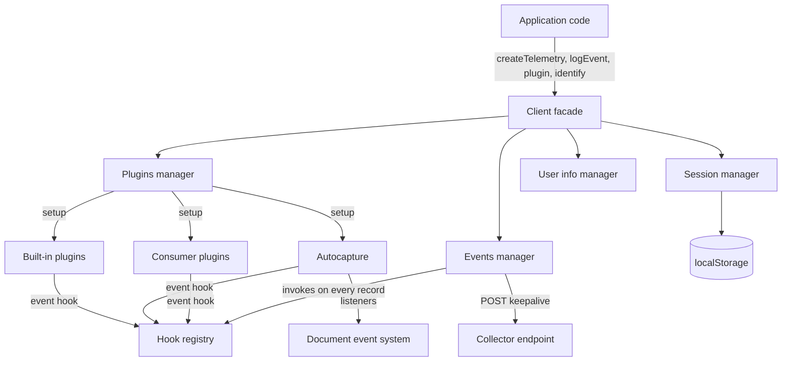
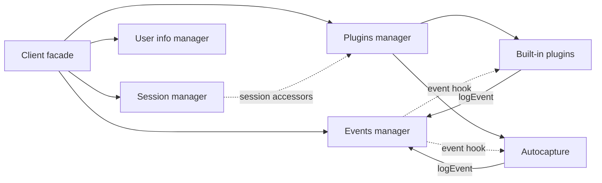
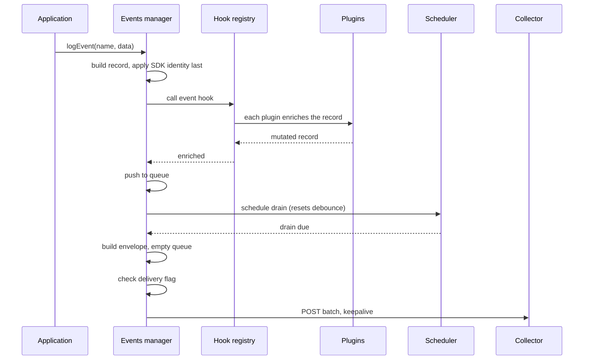
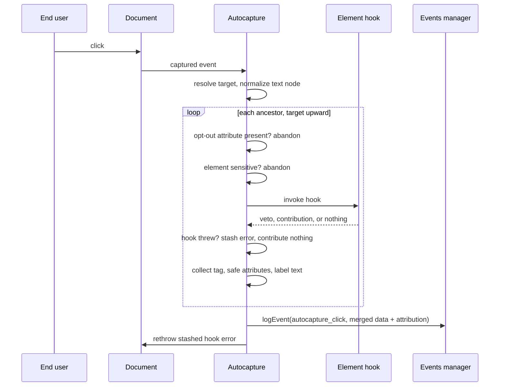

# Technical Design — Telemetry SDK

- [x] `p3` - **ID**: `cpt-frontx-telemetry-design-telemetry-sdk`

<!-- toc -->

- [1. Architecture Overview](#1-architecture-overview)
  - [1.1 Architectural Vision](#11-architectural-vision)
  - [1.2 Architecture Drivers](#12-architecture-drivers)
  - [1.3 Architecture Layers](#13-architecture-layers)
- [2. Principles & Constraints](#2-principles--constraints)
  - [2.1 Design Principles](#21-design-principles)
  - [2.2 Constraints](#22-constraints)
- [3. Technical Architecture](#3-technical-architecture)
  - [3.1 Domain Model](#31-domain-model)
  - [3.2 Component Model](#32-component-model)
  - [3.3 API Contracts](#33-api-contracts)
  - [3.4 Internal Dependencies](#34-internal-dependencies)
  - [3.5 External Dependencies](#35-external-dependencies)
  - [3.6 Interactions & Sequences](#36-interactions--sequences)
  - [3.7 Database schemas & tables](#37-database-schemas--tables)
- [4. Additional context](#4-additional-context)
- [5. Traceability](#5-traceability)

<!-- /toc -->

## 1. Architecture Overview

### 1.1 Architectural Vision

The SDK is a closure-based composition rather than a class hierarchy. `createTelemetry` builds a context — normalized configuration, a hook registry and a logger — and hands the same context to four managers: events, session, user info and plugins. The client it returns is a small facade whose methods delegate to those managers. Nothing is exported but the factory, the plugin helpers and the types, so the internal arrangement stays free to change.

The central decision is that **all context enrichment goes through one hook**. Session, device, navigation, application info, locale and autocapture are plugins, registered by the client's own start path using the same registration surface a consumer uses. The events manager knows nothing about any of them: it calls the `event` hook on every record before queueing it and lets whoever registered contribute. This keeps the enrichment surface honest — the SDK cannot give itself a capability it withholds from consumers, because it is a consumer of its own extension point.

Delivery is deliberately separated from collection. Records accumulate in an in-memory queue and a scheduler decides when to drain it, so the collection path is synchronous and cheap while the delivery path owns all the policy — batching, envelope construction, and the request. The two are joined only by the queue, which is what makes the collection guarantees hold even when delivery is suppressed or fails.

### 1.2 Architecture Drivers

#### Functional Drivers

| Requirement | Design Response |
|-------------|------------------|
| `cpt-frontx-telemetry-fr-client-creation` | `cpt-frontx-telemetry-component-client` normalizes configuration once at construction and guards every lifecycle method on the presence of `window`, so a server import yields a functioning object that collects nothing. |
| `cpt-frontx-telemetry-fr-client-lifecycle` | The client owns a start flag that teardown deliberately does not clear, making a second start refusable rather than silently duplicating hooks; teardown orders session detach, plugin teardown hooks, then events-manager teardown so a parting event still reaches the queue before the final delivery. |
| `cpt-frontx-telemetry-fr-custom-events` | `cpt-frontx-telemetry-component-events-manager` builds each record with caller fields first and SDK identity last, so identity cannot be overridden, then invokes the enrichment hook before queueing. |
| `cpt-frontx-telemetry-fr-batched-delivery` | A scheduler owned by the events manager debounces the drain and is reset by each new record; a document visibility listener and the teardown path both force an immediate drain, and the request carries `keepalive`. |
| `cpt-frontx-telemetry-fr-collector-endpoint` | The events manager resolves the endpoint from normalized configuration only, and selects between two envelope builders on the configured envelope version. |
| `cpt-frontx-telemetry-fr-delivery-disable` | The drain builds the envelope and empties the queue before consulting the delivery flag, so suppressing delivery changes exactly one step and leaves collection behaviour identical. |
| `cpt-frontx-telemetry-fr-session-continuity` | `cpt-frontx-telemetry-component-session-manager` stores the session in browser storage and derives its continuation from observed activity on scroll, keypress and click, debounced so that activity bursts cost one write. |
| `cpt-frontx-telemetry-fr-device-identity` | Storage keys are derived from the configured infix, and the device identifier is read or minted through the same storage helpers the session uses, then contributed by a built-in plugin like any other field. |
| `cpt-frontx-telemetry-fr-builtin-context` | `cpt-frontx-telemetry-component-builtin-plugins` supplies session, device, navigation and application-info plugins, registered by the client at start through the ordinary plugin surface. |
| `cpt-frontx-telemetry-fr-locale-source` | The locale plugin holds a reference to the application's source and reads it inside the enrichment hook, so the value is resolved per record rather than captured at setup. |
| `cpt-frontx-telemetry-fr-plugin-registration` | `cpt-frontx-telemetry-component-plugins-manager` keys plugins by name, filters falsy entries at registration, and runs every setup during the client's start. |
| `cpt-frontx-telemetry-fr-element-attribution` | `cpt-frontx-telemetry-component-autocapture` reads a hook from each element on the ancestor walk through a cross-realm registry symbol, and merges contributions under a closest-hook-wins rule. |
| `cpt-frontx-telemetry-fr-dom-autocapture` | The autocapture plugin installs passive capture-phase document listeners for the three interaction types and builds a record from the ancestor walk. |
| `cpt-frontx-telemetry-fr-capture-opt-out` | The walk tests for presence of the opt-out attribute on every ancestor and abandons the event on the first one found, without reading the attribute's value. |
| `cpt-frontx-telemetry-fr-redaction` | The walk consults element-sensitivity and value-safety predicates before recording anything, and abandons the whole event rather than the offending field. |
| `cpt-frontx-telemetry-fr-independent-publication` | The package declares its own version, a single entry point built to both module formats, and a published-file allowlist that admits the distribution, readme, license and notice while excluding the demo. |

#### NFR Allocation

| NFR ID | NFR Summary | Allocated To | Design Response | Verification Approach |
|--------|-------------|--------------|-----------------|----------------------|
| `cpt-frontx-telemetry-nfr-standalone` | No ecosystem, UI-framework or template-territory imports | The whole published source tree | No component imports outside the package except the user-agent parser; no framework binding exists in the package at all, so there is nothing for a framework import to attach to | Enforced in root configuration rather than by convention: a lint boundary for the source tree, plus dependency rules asserting the absence of a template-territory edge and confirming the package holds no intra-ecosystem edge. Type-only imports are included in the analysis. |
| `cpt-frontx-telemetry-nfr-dependency-minimalism` | At most one runtime dependency | Package manifest | One runtime dependency, the user-agent parser used by the device plugin; every other capability is built on browser APIs | Manifest inspection at review; the count is small enough that any addition is visible in the diff |
| `cpt-frontx-telemetry-nfr-hook-compatibility` | Element-hook contract evolves additively only | `cpt-frontx-telemetry-component-autocapture` | The contract is keyed by a registry symbol whose string is part of the contract, so a semantic change takes a new key rather than a new meaning; permitted attribution fields are allowlisted and reserved-prefix keys are stripped, so the honoured surface is explicit | Inspection at review. No test can observe a future version reinterpreting a current field, which is why this is a review obligation rather than a gate. |
| `cpt-frontx-telemetry-nfr-server-import-safety` | No throw without `window` | `cpt-frontx-telemetry-component-client` | Start, plugin registration and teardown each return early when `window` is undefined, before any manager is touched | Unit tests exercise the lifecycle in the absence of `window` |

### 1.3 Architecture Layers

- [x] `p3` - **ID**: `cpt-frontx-telemetry-tech-sdk-stack`

| Layer | Responsibility | Technology |
|-------|---------------|------------|
| Public surface | The factory, the plugin helpers, the element-hook key, and the types | TypeScript, single entry point |
| Client facade | Lifecycle, guarding, and delegation to managers | TypeScript closures |
| Managers | Queue and delivery, session continuity, user identity, plugin registry | TypeScript closures over a shared context |
| Enrichment | Every context field, contributed through the event hook | Plugin contract |
| Browser adapters | Storage keys, DOM predicates, user-agent parsing, scheduling | Browser APIs, one third-party parser |

## 2. Principles & Constraints

### 2.1 Design Principles

#### Enrichment Only Through The Plugin Surface

- [x] `p2` - **ID**: `cpt-frontx-telemetry-principle-enrichment-via-plugins`

Every context field on a record is contributed by a plugin through the `event` hook, including all of the SDK's own. The events manager holds no knowledge of session, device, navigation, application or locale fields; it invokes the hook and queues whatever comes back.

This matters because the alternative — built-in fields written directly by the events manager, with plugins layered on top — produces two enrichment paths with different capabilities, and the consumer's is always the weaker one. Keeping the SDK on the same path means a gap in the plugin contract is a gap the SDK feels first.

#### Collection And Delivery Are Separable

- [x] `p2` - **ID**: `cpt-frontx-telemetry-principle-collection-delivery-separation`

Recording an event and delivering it are joined only by the queue. Collection is synchronous, cannot fail on the caller's behalf, and does not depend on the endpoint being reachable or delivery being enabled. Delivery owns batching policy, envelope construction and the request.

The consequence is deliberate and must be stated wherever the delivery flag is offered: suppressing delivery does not suppress collection. Enrichment still runs, the queue is still drained, and the identifiers the SDK stores are still written. A consent gate therefore belongs on client start, not on the delivery flag.

#### Untrusted Extension Code

- [x] `p2` - **ID**: `cpt-frontx-telemetry-principle-untrusted-extensions`

An element hook is written by code the SDK does not control and may fail or return anything. A failing hook degrades its own element's contribution to nothing and never aborts the event the rest of the walk is building. The failure is not swallowed: it is carried out of the walk and rethrown after the event has been emitted, so it reaches the page's error handling with a real stack.

Distinguishing a consumer's failure from the SDK's own is part of the principle. Processing a hook's *result* stays outside the failure boundary, so a defect in the SDK's own merge logic surfaces as an internal error rather than being misattributed to the consumer.

#### Identity Is Never Caller-Assignable

- [x] `p2` - **ID**: `cpt-frontx-telemetry-principle-sdk-owned-identity`

A record's identifier and trigger timestamp are applied after every caller-supplied field and after any hook contribution merged into them. Neither a caller nor a plugin can set or replace them.

Without this, de-duplication and ordering at the collector depend on the discipline of every call site and every plugin. Making it structural — a spread order, not a validation rule — means there is no path by which it can be violated.

#### Additive-Only Cross-Version Contracts

- [x] `p2` - **ID**: `cpt-frontx-telemetry-principle-additive-cross-version`

Where a contract is read by one copy of the SDK and written by independently deployed code, it evolves by addition only. Changing what an existing field means requires a new registry key, not a new version, because a version cannot coordinate writers that were deployed separately and are running concurrently on the same page.

### 2.2 Constraints

#### No Intra-Ecosystem Or Framework Coupling

- [x] `p2` - **ID**: `cpt-frontx-telemetry-constraint-standalone-boundary`

The published source **MUST NOT** import another ecosystem package, a UI framework, or template territory. This is the membership property the package claims in the published-libraries layer, and it is enforced in root configuration rather than by convention.

Its most visible consequence is the absence of an application-wiring entry point. The framework this SDK would bind to lives in template territory, and the boundary forbids the import, so binding a client to an application's lifecycle is template-side work and this package exposes no API for it.

#### Browser-Only Runtime With Safe Server Import

- [x] `p2` - **ID**: `cpt-frontx-telemetry-constraint-browser-runtime`

Collection **MUST** require a browser environment, and the package **MUST** remain importable without one. Every lifecycle method returns early when `window` is undefined. No polyfills are bundled, so the floor is browsers providing `fetch`, `localStorage`, `crypto.randomUUID` and `Intl.Locale`.

#### Externally-Fixed Record Field Names

- [x] `p2` - **ID**: `cpt-frontx-telemetry-constraint-external-record-schema`

The record field names and the batch envelope **MUST** be treated as an external contract. The package is extracted from a codebase whose collectors and dashboards already consume them, so they cannot be renamed for internal tidiness. This is why several declared fields that nothing currently populates are retained rather than removed.

#### Reserved Built-In Plugin Names

- [x] `p2` - **ID**: `cpt-frontx-telemetry-constraint-reserved-plugin-names`

The names of the built-in plugins **MUST NOT** be used by consumer plugins. Because plugins are keyed by name and the client registers the built-ins after the caller's, a colliding consumer plugin is silently replaced rather than rejected. The registry's last-write-wins rule is what makes replacing a built-in possible at all, so the reservation is documented rather than enforced.

## 3. Technical Architecture

### 3.1 Domain Model

**Technology**: TypeScript type declarations

**Location**: [src/utils/eventTypes.ts](../src/utils/eventTypes.ts), [src/utils/types.ts](../src/utils/types.ts)

**Core Entities**:

| Entity | Description | Schema |
|--------|-------------|--------|
| Record | One event as sent: SDK-assigned identity and trigger time, caller-supplied name and data, and the context fields plugins contribute | [eventTypes.ts](../src/utils/eventTypes.ts) |
| Batch envelope | The request body — a record set, and in the second version a batch-level block holding fields common to every record | [eventTypes.ts](../src/utils/eventTypes.ts) |
| Session | Session identifier, start time and last-activity time, persisted in browser storage | [types.ts](../src/utils/types.ts) |
| Normalized configuration | Every option resolved to a concrete value, the only configuration any component sees | [types.ts](../src/utils/types.ts) |
| Plugin | A name and a setup function | [types.ts](../src/utils/types.ts) |
| Plugin context | What a plugin's setup receives: normalized configuration, an event logger, session accessors, a logger, and a hook registrar | [types.ts](../src/utils/types.ts) |
| Element-hook result | An optional capture veto, optional service attribution, and optional custom data | [elementHook.ts](../src/plugins/autocapture/elementHook.ts) |

**Relationships**:
- Client → Normalized configuration: built once at construction and shared, unmodified, with every manager and every plugin.
- Record → Session: the session plugin stamps the current session identifier onto each record; the record does not own the session.
- Batch envelope → Record: an envelope carries the records drained by one flush, and in the second version lifts their common fields out of them.
- Plugin → Record: a plugin never constructs a record; it mutates one inside the `event` hook.
- Element-hook result → Record: contributes attribution and data to an autocaptured record only, subject to an allowlist.

### 3.2 Component Model

#### Client Facade

- [x] `p2` - **ID**: `cpt-frontx-telemetry-component-client`

##### Why this component exists

Gives the application one object to hold and one lifecycle to manage, and confines every environment guard and every lifecycle rule to a single place so no manager has to defend itself against being used out of order.

##### Responsibility scope

- Normalizes raw configuration once and builds the shared context: configuration, hook registry, logger.
- Constructs the four managers and wires them to each other.
- Owns the lifecycle: start, teardown, and the single-use rule that refuses a second start.
- Registers the built-in plugins as part of start, after any the caller registered.
- Guards every lifecycle method on the presence of `window`.
- Orders teardown so that session detach precedes plugin teardown hooks, which precede the events manager's flushing teardown.

##### Responsibility boundaries

- Does NOT enrich records, own the queue, or construct envelopes.
- Does NOT read or write browser storage.
- Does NOT re-enter a usable state after teardown; the start flag is deliberately not cleared, so restarting is refused rather than repaired.
- Does NOT bind to any application framework — no such entry point exists in this package.

##### Related components (by ID)

- `cpt-frontx-telemetry-component-events-manager` — delegates event logging to it, and calls its teardown last
- `cpt-frontx-telemetry-component-session-manager` — starts and refreshes it, and detaches it first on teardown
- `cpt-frontx-telemetry-component-user-info-manager` — delegates user identification to it
- `cpt-frontx-telemetry-component-plugins-manager` — delegates registration to it and triggers its setup pass during start
- `cpt-frontx-telemetry-component-builtin-plugins` — registers them itself during start

#### Events Manager

- [x] `p2` - **ID**: `cpt-frontx-telemetry-component-events-manager`

##### Why this component exists

Holds everything about how a record becomes a request — identity, enrichment dispatch, the queue, the batching policy, the envelope and the transport — so that the collection path stays synchronous and the delivery policy has one owner.

##### Responsibility scope

- Constructs each record: caller fields first, then SDK-assigned identifier and trigger timestamp.
- Accepts either a name-and-data call or a whole record, normalizing the two forms.
- Invokes the `event` hook on every record before queueing.
- Owns the in-memory queue and the scheduler that debounces the drain.
- Forces a drain when the document becomes hidden, and on its own teardown.
- Builds the envelope for the configured version, including hoisting fields common to a multi-record batch.
- Issues the request with `keepalive`, and consults the delivery flag only after the queue has been drained.

##### Responsibility boundaries

- Does NOT know any context field by name; every one arrives through the hook.
- Does NOT retry, persist undelivered batches, or report delivery failure to the application — a rejected request reaches the console only. This is a known gap, not an oversight.
- Does NOT decide the endpoint; it reads the resolved value from normalized configuration.
- Does NOT own session or user identity.

##### Related components (by ID)

- `cpt-frontx-telemetry-component-client` — constructed and torn down by it
- `cpt-frontx-telemetry-component-builtin-plugins` — invokes their `event` hooks; they also call back into it to log their own events
- `cpt-frontx-telemetry-component-autocapture` — invokes its `event` hook and receives its captured events

#### Session Manager

- [x] `p2` - **ID**: `cpt-frontx-telemetry-component-session-manager`

##### Why this component exists

Makes session a property of observed user activity rather than of page lifetime, so that a session spans navigation and is comparable between single-page and multi-page applications.

##### Responsibility scope

- Reads and writes the session record — identifier, start time, last activity — in browser storage.
- Continues an existing session or mints a new identifier, depending on whether the stored record is still within the inactivity window.
- Observes scroll, keypress and click as activity, debounced so an activity burst costs one write.
- Exposes session accessors for plugins, and detaches its listeners on teardown.

##### Responsibility boundaries

- Does NOT stamp the session onto records; the session plugin does that through the hook.
- Does NOT own the device identifier.
- Does NOT emit the session-start event; the session plugin does.

##### Related components (by ID)

- `cpt-frontx-telemetry-component-client` — started, refreshed and detached by it
- `cpt-frontx-telemetry-component-plugins-manager` — session accessors reach plugins through the context it builds
- `cpt-frontx-telemetry-component-builtin-plugins` — the session plugin reads it and emits the session-start event

#### User Info Manager

- [x] `p2` - **ID**: `cpt-frontx-telemetry-component-user-info-manager`

##### Why this component exists

Holds the application-supplied user identity, which has a different lifetime from everything else the SDK knows: it is unknown at construction, may arrive at any point, and is not derived from the browser.

##### Responsibility scope

- Records the user identifier the application supplies.
- Makes it available for enrichment of subsequent records.

##### Responsibility boundaries

- Does NOT affect the device identifier, which is pseudonymous and independent of whether a user is known.
- Does NOT persist the user identifier, and does NOT retroactively attach it to records already queued.

##### Related components (by ID)

- `cpt-frontx-telemetry-component-client` — user identification is delegated to it

#### Plugins Manager

- [x] `p2` - **ID**: `cpt-frontx-telemetry-component-plugins-manager`

##### Why this component exists

Owns the registry and the single setup pass, which is what makes plugin ordering a stated rule with one enforcement point rather than an emergent property of call order.

##### Responsibility scope

- Keys plugins by name, so a later registration of a name replaces the earlier one.
- Filters falsy entries at registration, so conditional registration needs no branch at the call site.
- Builds the plugin context — normalized configuration, event logger, session accessors, logger, hook registrar.
- Runs every registered plugin's setup in one pass, triggered by client start.

##### Responsibility boundaries

- Does NOT set up a plugin registered after the setup pass; it is stored and never set up. This ordering requirement is documented rather than enforced.
- Does NOT reject a name that collides with a built-in; last write wins, which is what makes replacing a built-in possible and is why the built-in names are reserved by documentation.
- Does NOT invoke hooks; it only registers them.

##### Related components (by ID)

- `cpt-frontx-telemetry-component-client` — registration is delegated to it, and its setup pass is triggered by start
- `cpt-frontx-telemetry-component-session-manager` — its accessors are placed into the plugin context
- `cpt-frontx-telemetry-component-builtin-plugins` — registered through it like any other plugin
- `cpt-frontx-telemetry-component-autocapture` — registered through it like any other plugin

#### Built-In Plugins

- [x] `p2` - **ID**: `cpt-frontx-telemetry-component-builtin-plugins`

##### Why this component exists

Supplies the context that makes an event stream answerable — session, device, navigation, application identity, locale — as ordinary plugins, so the SDK's enrichment and a consumer's use the same surface.

##### Responsibility scope

- Session: stamps the current session onto records and emits an event when a session begins.
- Device: derives browser, operating system and platform fields from the user agent, plus viewport and timezone.
- Navigation: emits an event on every path change, including History API transitions and back-forward navigation.
- Application info: stamps application name and version, and prepends the application to the service call chain, warning when a hook-supplied chain does not contain its own service.
- Locale: reads the application's locale source per record and normalizes it, falling back to the browser's reported language.

##### Responsibility boundaries

- Does NOT construct records directly except where emitting its own event, which goes through the events manager like any other.
- Does NOT read configuration other than the normalized form in its context.
- Locale does NOT capture the source's value at setup; it reads it on every record so a mid-session change is visible.

##### Related components (by ID)

- `cpt-frontx-telemetry-component-plugins-manager` — registered and set up through it
- `cpt-frontx-telemetry-component-events-manager` — enriches records through its hook, and logs its own events through it
- `cpt-frontx-telemetry-component-session-manager` — the session plugin reads session state from it

#### Autocapture

- [x] `p2` - **ID**: `cpt-frontx-telemetry-component-autocapture`

##### Why this component exists

Records interaction without per-element instrumentation, which is the part of an event stream that is least likely to be instrumented by hand and most likely to be requested. It is also where all the safety machinery lives, because it is the only component that records data nobody wrote for this purpose.

##### Responsibility scope

- Installs passive capture-phase document listeners for click, change and submit, and removes them on teardown using matching options.
- Walks from the interaction target up through its ancestors, crossing shadow-root hosts.
- Abandons the whole event on the first opt-out attribute found, testing presence only and never reading the value.
- Abandons the whole event when any element on the path is sensitive by predicate.
- Invokes each ancestor's element hook: any hook may veto the event; the closest hook returning a contribution wins its entire field set, with attribution and data never mixed across hooks.
- Records the target's tag, an allowlisted subset of attributes with sensitive values dropped, and text for elements whose text is their label, truncated.
- Adds the anchor target for anchor interactions, and marks it external when the host differs from the page.
- Merges hook-contributed data beneath its own keys, strips reserved-prefix keys from a hook's data, and allows only the three attribution fields.
- Carries a failing hook's error out of the walk and rethrows it after the event has been emitted.

##### Responsibility boundaries

- Does NOT swallow errors. A consumer hook's failure is rethrown after emission; an internal defect propagates directly out of the listener.
- Does NOT let a hook override its own captured fields; its keys are applied last.
- Does NOT stitch service call chains together across hooks; a hook must supply its own complete chain below the application.
- Does NOT guarantee that redaction is sufficient. It is a pattern-based safety net, and the authoritative controls are the subtree opt-out and hook veto.

##### Related components (by ID)

- `cpt-frontx-telemetry-component-plugins-manager` — registered and set up through it
- `cpt-frontx-telemetry-component-events-manager` — emits captured events through it, and enriches through its hook

### 3.3 API Contracts

- [x] `p2` - **ID**: `cpt-frontx-telemetry-interface-package-entry`

- **Contracts**: `cpt-frontx-telemetry-contract-batch-envelope`, `cpt-frontx-telemetry-contract-locale-source`
- **Technology**: TypeScript module, one entry point, built to both module formats with declarations
- **Location**: [src/index.ts](../src/index.ts)

The single entry point exposes the three public surfaces the PRD specifies, and the components realizing each:

| Public surface | Realized by | Notes |
|----------------|-------------|-------|
| `cpt-frontx-telemetry-interface-client` | `cpt-frontx-telemetry-component-client` | The factory and the client facade. The only way to obtain a client. |
| `cpt-frontx-telemetry-interface-plugin` | `cpt-frontx-telemetry-component-plugins-manager` | The plugin contract and the context its setup receives. The SDK's own built-in enrichment is written against it. |
| `cpt-frontx-telemetry-interface-element-hook` | `cpt-frontx-telemetry-component-autocapture` | The cross-realm registry symbol, the hook function type and its result type. |

**Endpoints Overview**:

| Method | Path | Description | Stability |
|--------|------|-------------|-----------|
| `createTelemetry` | `.` | Builds a client from configuration. The only way to obtain one. | unstable |
| `start` | client method | Begins collection: registers built-ins, sets plugins up, installs listeners. Chainable. Refused on a second call. | unstable |
| `identify` | client method | Attaches a user identifier to subsequent records. Chainable. | unstable |
| `logEvent` | client method | Records a named event with optional data, or a whole record. | unstable |
| `plugin` | client method | Registers plugins, ignoring falsy entries. Chainable. Must precede start. | unstable |
| `destroy` | client method | Runs teardown hooks, delivers what remains, detaches listeners. | unstable |
| `telemetryLocalePlugin` | `.` | Built-in plugin reading locale from an application source. | unstable |
| `telemetryElementHookKey` | `.` | Cross-realm registry symbol under which an element registers its hook. | stable |

The element-hook key is the one `stable` item on an otherwise `unstable` surface, and the difference is deliberate: its writers are independently deployed and cannot be coordinated by a version bump, so it is additive-only permanently while the rest of the API is still free to change.

### 3.4 Internal Dependencies

None. The package imports no other package in this ecosystem, which is the property recorded in `cpt-frontx-telemetry-constraint-standalone-boundary` and enforced in root configuration.

**Dependency Rules** (per project conventions):
- No circular dependencies
- No intra-ecosystem import from this package's source, including type-only imports
- No import of template territory
- No UI-framework import

### 3.5 External Dependencies

#### Collector Endpoint

| Dependency Module | Interface Used | Purpose |
|-------------------|---------------|---------|
| Collector endpoint | `cpt-frontx-telemetry-contract-batch-envelope` over HTTP POST | Receives batches. Opaque to the SDK: no response handling beyond a console-logged rejection. |

#### Browser Runtime

| Dependency Module | Interface Used | Purpose |
|-------------------|---------------|---------|
| Document event system | Capture-phase passive listeners; visibility state | Autocapture's interaction sources, and the hidden-page delivery trigger |
| `localStorage` | Keyed read and write | Session record and device identifier persistence |
| `fetch` | POST with `keepalive` | Batch delivery that survives page teardown |
| `crypto.randomUUID` | Identifier generation | Record, session and device identifiers |
| `Intl.Locale` | Locale normalization | Normalizing the application's locale to a standard tag |
| History API events | `pushState`, `replaceState`, `popstate` | Navigation plugin's path-change detection |

#### User-Agent Parser

| Dependency Module | Interface Used | Purpose |
|-------------------|---------------|---------|
| User-agent parser | Library call | Browser, operating system and platform fields for the device plugin. The only runtime dependency. |

**Dependency Rules** (per project conventions):
- Only the device plugin talks to the parser; no other component depends on it
- Browser APIs are reached through adapter helpers rather than inline, so the environment guard has one place to live

### 3.6 Interactions & Sequences

#### Record Enrichment And Batched Delivery

- [x] `p3` - **ID**: `cpt-frontx-telemetry-seq-record-delivery`

**Use cases**: `cpt-frontx-telemetry-usecase-instrument-application`

**Actors**: `cpt-frontx-telemetry-actor-application-developer`, `cpt-frontx-telemetry-actor-collector`

**Description**: The path every record takes. Identity is applied after caller fields so it cannot be overridden; enrichment happens before queueing so a record is complete when queued; the queue is emptied before the delivery flag is consulted, which is what makes suppressing delivery leave collection behaviour identical.

#### Autocapture Ancestor Walk With Element Hooks

- [x] `p3` - **ID**: `cpt-frontx-telemetry-seq-autocapture-walk`

**Use cases**: `cpt-frontx-telemetry-usecase-attribute-component`

**Actors**: `cpt-frontx-telemetry-actor-end-user`, `cpt-frontx-telemetry-actor-application-developer`

**Description**: One walk performs suppression, redaction, attribution and field collection together, because all four depend on the same ancestor chain. Suppression is checked before anything is read. A hook failure degrades only its own element and is rethrown *after* emission, so the event is not lost and the error still reaches the page's error handling.

### 3.7 Database schemas & tables

Not applicable. The package holds no database. Its only persistence is two browser-storage keys it owns — the session record and the device identifier — documented as entities in section 3.1 and in the package readme, where their lifetime and privacy consequences are stated.

## 4. Additional context

The package is extracted from an internal codebase that is already in production, which explains two things a fresh design would do differently. The record field names and batch envelope are an external contract because collectors already read them, so `cpt-frontx-telemetry-constraint-external-record-schema` freezes vocabulary this design would otherwise choose. And the transport is the weakest part of the architecture — no retry, an envelope that stringifies nested objects, a same-origin default endpoint — recorded as known gaps in the package readme and as risks in the PRD rather than presented as decisions. A pluggable transport is the intended replacement, and the collection-and-delivery separation in `cpt-frontx-telemetry-principle-collection-delivery-separation` is what makes replacing it a contained change.

This package is also the first member of the published-libraries layer to own its own artifact set, so its registration as a child system is the pilot for federated artifact ownership across the ecosystem.

## 5. Traceability

- **PRD**: [PRD.md](./PRD.md)
- **Features**: [features/](./features/)
- **Package guidance**: [../README.md](../README.md), [../CLAUDE.md](../CLAUDE.md)

This artifact set exists under the ecosystem layer-partition and artifact-federation decision, which is recorded as a root ADR. The decision identifier is deliberately not cited here: that ADR is still proposed on a separate branch, and citing its identifier would make this package's artifacts unresolvable until it lands. The link is added once it does.
